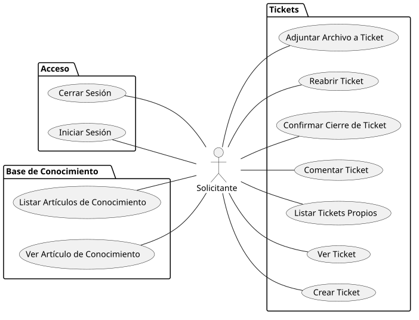
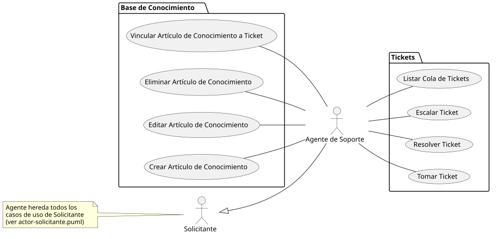
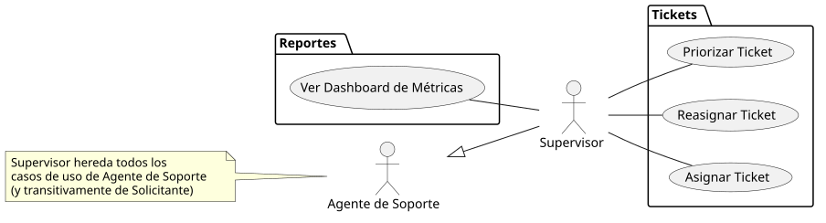
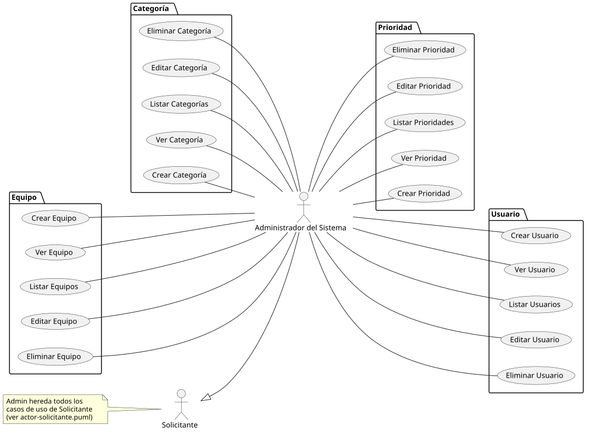

[HelpDesk](../README.md) / [Fase de Inicio](README.md)

# Modelo de Casos de Uso

Listado de actores y casos de uso a nivel de nombre y objetivo. Sin flujos ni escenarios todavía — eso corresponde al detalle de casos de uso en Elaboración, una vez priorizados los arquitectónicamente significativos.

## Actores

| Actor | Descripción | Generaliza a |
|---|---|---|
| Solicitante | Cualquier persona que reporta o da seguimiento a sus propias solicitudes. Rol base: todo actor humano del sistema puede actuar como Solicitante. | — |
| Agente de Soporte | Atiende y resuelve tickets asignados. Pertenece a un Equipo. El nivel (N1/N2/N3) es un dato del agente, no un actor distinto: todos ejecutan los mismos casos de uso, lo que cambia es a quién se le puede escalar un ticket. | Solicitante |
| Supervisor | Vigila carga de trabajo y cumplimiento de SLA del Equipo al que pertenece (heredado de Agente de Soporte). Además de atender tickets como cualquier agente, puede asignarlos y reasignarlos dentro de su equipo. | Agente de Soporte |
| Administrador del Sistema | Configura categorías, equipos, prioridades, SLA, usuarios y permisos de la instancia. | Solicitante |

## Casos de uso

Agrupados por el actor que los introduce. Un actor que generaliza a otro (ver tabla de arriba) también puede ejecutar **todos** los casos de uso de ese actor, sin que se repitan en su lista — se indica al inicio de cada sección qué hereda.

Convención de nombres: **Ver** = detalle de una instancia, **Listar** = colección. Aplicada pareja en todo el catálogo para que el nombre ya diga si es detalle o listado, sin usar verbos paraguas como "Consultar" o "Gestionar".

Cada actor tiene su diagrama con los casos de uso que introduce (no repite los heredados — mismo criterio que las tablas), hecho en PlantUML.

### Solicitante

<table>
<tr><td align="center">

</td></tr>
<tr><td align="center"><i><a href="../../puml/01-fase-inicio/casos-de-uso/actor-solicitante.puml">Código fuente</a></i></td></tr>
</table>

| ID | Caso de uso | Objetivo |
|---|---|---|
| UC-01 | Iniciar Sesión | Autenticarse en el sistema |
| UC-02 | Cerrar Sesión | Finalizar la sesión activa |
| UC-03 | Crear Ticket | Reportar una incidencia o solicitud |
| UC-04 | Ver Ticket | Ver el detalle de un ticket propio, incluido su historial de auditoría |
| UC-05 | Listar Tickets Propios | Ver el listado de tickets que reportó |
| UC-06 | Comentar Ticket | Agregar información adicional a un ticket propio |
| UC-07 | Confirmar Cierre de Ticket | Aceptar que la solución resolvió el problema |
| UC-08 | Reabrir Ticket | Rechazar una solución y devolver el ticket a atención |
| UC-09 | Ver Artículo de Conocimiento | Ver el contenido de un artículo con visibilidad Público |
| UC-10 | Listar Artículos de Conocimiento | Buscar, entre los artículos con visibilidad Público, uno que resuelva su problema |
| UC-42 | Adjuntar Archivo a Ticket | Agregar un archivo (captura, log, documento) como evidencia a un ticket propio |

### Agente de Soporte

*Hereda todos los casos de uso de Solicitante (tabla de arriba, incluido UC-42) — incluye Ver/Listar Artículo de Conocimiento, solo que al ejecutarlos como Agente el alcance es mayor: ve artículos Público **e** Interno, por ser personal técnico. Aquí se agrega además lo que puede hacer con ellos (crearlos, editarlos).*

<table>
<tr><td align="center">

</td></tr>
<tr><td align="center"><i><a href="../../puml/01-fase-inicio/casos-de-uso/actor-agente-soporte.puml">Código fuente</a></i></td></tr>
</table>

| ID | Caso de uso | Objetivo |
|---|---|---|
| UC-11 | Tomar Ticket | Asignarse un ticket disponible de la cola |
| UC-12 | Resolver Ticket | Marcar un ticket como resuelto |
| UC-13 | Escalar Ticket | Transferirlo a un agente de nivel superior |
| UC-14 | Listar Cola de Tickets | Ver los tickets sin asignar de su Equipo y los que tiene asignados a él |
| UC-15 | Crear Artículo de Conocimiento | Documentar una solución reutilizable, definiendo su visibilidad |
| UC-16 | Editar Artículo de Conocimiento | Actualizar un artículo existente, incluida su visibilidad |
| UC-17 | Eliminar Artículo de Conocimiento | Retirar un artículo obsoleto |
| UC-43 | Vincular Artículo de Conocimiento a Ticket | Asociar un artículo existente a un ticket como referencia de solución |

### Supervisor

*Hereda todos los casos de uso de Agente de Soporte (tabla de arriba, incluido UC-43) y, transitivamente, todos los de Solicitante (incluido UC-42).*

<table>
<tr><td align="center">

</td></tr>
<tr><td align="center"><i><a href="../../puml/01-fase-inicio/casos-de-uso/actor-supervisor.puml">Código fuente</a></i></td></tr>
</table>

| ID | Caso de uso | Objetivo |
|---|---|---|
| UC-18 | Asignar Ticket | Asignar un ticket sin asignar a un agente específico de su Equipo |
| UC-19 | Reasignar Ticket | Mover un ticket ya asignado de un agente a otro |
| UC-20 | Ver Dashboard de Métricas | Ver KPIs de volumen, tiempos y cumplimiento de SLA |
| UC-41 | Priorizar Ticket | Confirmar o ajustar la Prioridad real de un ticket recién creado, fijando el SLA aplicable |

### Administrador del Sistema

*Hereda todos los casos de uso de Solicitante (tabla de arriba, incluido UC-42).*

<table>
<tr><td align="center">

</td></tr>
<tr><td align="center"><i><a href="../../puml/01-fase-inicio/casos-de-uso/actor-administrador.puml">Código fuente</a></i></td></tr>
</table>

#### Categoría

| ID | Caso de uso | Objetivo |
|---|---|---|
| UC-21 | Crear Categoría | Dar de alta una categoría de ticket |
| UC-22 | Ver Categoría | Ver el detalle de una categoría, incluido el Equipo que la atiende |
| UC-23 | Listar Categorías | Ver el catálogo completo de categorías |
| UC-24 | Editar Categoría | Modificar una categoría o el Equipo que la atiende |
| UC-25 | Eliminar Categoría | Dar de baja una categoría |

#### Equipo

| ID | Caso de uso | Objetivo |
|---|---|---|
| UC-26 | Crear Equipo | Dar de alta un equipo de soporte |
| UC-27 | Ver Equipo | Ver el detalle de un equipo y sus miembros |
| UC-28 | Listar Equipos | Ver el catálogo completo de equipos |
| UC-29 | Editar Equipo | Modificar el nombre de un equipo |
| UC-30 | Eliminar Equipo | Dar de baja un equipo |

#### Prioridad (incluye su SLA — ver decisiones)

| ID | Caso de uso | Objetivo |
|---|---|---|
| UC-31 | Crear Prioridad | Dar de alta un nivel de prioridad con sus tiempos de SLA |
| UC-32 | Ver Prioridad | Ver el detalle de una prioridad y su SLA |
| UC-33 | Listar Prioridades | Ver el catálogo completo de prioridades |
| UC-34 | Editar Prioridad | Modificar una prioridad o sus tiempos de SLA |
| UC-35 | Eliminar Prioridad | Dar de baja un nivel de prioridad |

#### Usuario

| ID | Caso de uso | Objetivo |
|---|---|---|
| UC-36 | Crear Usuario | Dar de alta un usuario y asignarle un rol |
| UC-37 | Ver Usuario | Ver el detalle de un usuario, su rol y su Equipo (si aplica) |
| UC-38 | Listar Usuarios | Ver el catálogo completo de usuarios |
| UC-39 | Editar Usuario | Modificar datos, rol o Equipo de un usuario |
| UC-40 | Eliminar Usuario | Dar de baja un usuario |

**Total: 43 casos de uso** — 11 introducidos por Solicitante, 8 por Agente de Soporte, 4 por Supervisor, 20 por Administrador del Sistema. Este número es el que referencia el [Plan de Desarrollo de Software](plan-desarrollo-software.md) al calcular qué queda fuera de la primera iteración de Elaboración — actualícese junto con el catálogo si se agrega o quita un caso de uso.

## Decisiones de modelado (y por qué)

- **`Solicitante` es actor aunque no sea clase del dominio.** Actor y clase de dominio son vistas distintas: un actor es un rol de interacción con el sistema, no necesariamente una entidad persistida. Esto es consistente con la decisión ya tomada en el [Modelo de Dominio](modelo-dominio/README.md) de que Solicitante es un rol, no una clase.
- **Se usa generalización de actores (`Solicitante ← Agente de Soporte ← Supervisor`, `Solicitante ← Administrador`) en vez de repetir casos de uso.** Evita listar "Crear Ticket" cuatro veces — un Agente también puede reportar sus propios problemas, un Administrador también es empleado. La generalización expresa eso sin duplicación, igual que en el diagrama de clases.
- **No se separan actores "Agente N1" y "Agente N2/N3".** Ambos ejecutan exactamente los mismos casos de uso; el nivel solo determina el destino de un escalamiento (ver decisión de `nivel` en el Diagrama de Clases), no cambia qué puede hacer el actor.
- **No hay un caso de uso "Recibir Notificación".** Recibir una notificación no es un objetivo que el actor persigue activamente — es una consecuencia de otro caso de uso (Crear Ticket, Resolver Ticket, Asignar/Tomar Ticket). Las reglas de notificación ya capturadas en el Modelo de Dominio se modelarán como extensiones de esos casos de uso cuando se detallen sus flujos, no como casos de uso propios.
- **Ningún caso de uso se llama "Gestionar X".** "Gestionar" no es un objetivo verificable de un actor, es una etiqueta que esconde varios casos de uso distintos (crear, ver, listar, editar, eliminar). Cada uno se lista por separado, siguiendo el mismo criterio que el ejemplo de referencia.
- **Se eliminó "Atender Ticket".** Por el mismo motivo: era una etiqueta vaga que en realidad ya cubren Tomar, Comentar, Resolver y Escalar Ticket por separado. No aportaba un objetivo propio.
- **`SLA` no tiene CRUD propio.** No existe independiente de una `Prioridad` (relación 1 a 1 en el Modelo de Dominio) — se crea y edita como parte de Crear/Editar Prioridad, no como recurso propio.
- **`Iniciar Sesión` / `Cerrar Sesión` se agregan como base de `Solicitante`**, no como actor "no logueado" aparte. Todo actor necesita autenticarse antes de lo demás; separarlo en un actor propio (como en el ejemplo de referencia) es válido pero implica modelar la extensión condicional por rol tras el login, que es detalle de flujo — se deja para cuando se detalle ese caso de uso, no en esta fase de solo listar.
- **`Equipo` tiene CRUD propio bajo Administrador, no bajo Supervisor.** Crear/editar/eliminar equipos es configuración estructural de la instancia (como Categoría o Prioridad), coherente con que Administrador ya es quien gestiona esas entidades. El Supervisor opera *dentro* de su equipo (asigna, reasigna), no lo estructura.
- **La pertenencia de un agente a un Equipo se edita desde Editar Usuario, no desde un caso de uso propio de Equipo.** Es un dato del agente (ver decisión equivalente en el Modelo de Dominio), así que se administra donde se administra el resto de sus datos, evitando dos caminos distintos para lo mismo.
- **`Asignar Ticket` y `Reasignar Ticket` son casos de uso distintos, no uno solo.** Tienen precondiciones distintas: Asignar parte de un ticket sin dueño (viene de la cola del equipo), Reasignar parte de un ticket que ya tiene un agente asignado. Fusionarlos hubiera vuelto a caer en un caso de uso ambiguo, lo mismo que se evitó con "Gestionar" y "Atender".
- **`Ver`/`Listar Artículo de Conocimiento` no se duplican por rol.** El alcance (solo Público vs. Público+Interno) depende de quién ejecuta el mismo caso de uso, no de un caso de uso distinto por actor — es una regla de negocio del flujo (ya capturada en el [Modelo de Dominio](modelo-dominio/README.md)), no una razón para crear "Ver Artículo de Conocimiento (Interno)" aparte.
- **`UC-41 Priorizar Ticket` (Supervisor) se agregó al detallar el flujo de `Crear Ticket` en Elaboración**, no se detectó en el listado inicial. Quedó numerado fuera de secuencia (después de UC-40) para no tener que renumerar y re-renderizar los otros 20 casos de uso ya cerrados — la lista de casos de uso es un artefacto vivo, no se congela tras la primera pasada. El motivo de fondo: el Solicitante no debe elegir la Prioridad de su propio ticket (todo le parece urgente); la fija el Supervisor al triar. Ver [Especificación — Tickets](../02-fase-elaboracion/especificacion-casos-uso/tickets/README.md).
- **"Auditar quién hizo qué sobre un ticket" (necesidad explícita del Supervisor, Documento de Visión 3.4) no tiene caso de uso propio — vive dentro de `Ver Ticket` (UC-04).** No se creó un "Ver Historial de Auditoría" aparte porque el historial es parte del detalle de un ticket, no un recurso independiente que se consulte solo; mismo motivo que los comentarios no tienen su propio "Ver Comentarios".
- **No existe "Editar Ticket".** Es deliberado, no un olvido: los datos propios de un ticket (título, descripción, categoría) no se editan una vez creado, precisamente porque la trazabilidad/auditoría es un requisito fuerte del producto (Documento de Visión, sección 7) y permitir edición libre la debilitaría. Una corrección o aclaración se hace vía `Comentar Ticket` (UC-06), que sí queda en el historial. Mismo criterio que "Se eliminó 'Atender Ticket'": si algo no tiene un objetivo propio y verificable distinto de lo que ya cubren otros casos de uso, no se agrega.
- **Las notas de herencia ("*Hereda todos los casos de uso de...*") dejaron de citar rangos fijos de ID ("UC-01 a UC-10") y pasaron a decir "tabla de arriba, incluido UC-XX".** Tras agregar `UC-42` y `UC-43` fuera de esos rangos, las notas quedaron desactualizadas — un lector que solo mirase la nota (su propósito, para no tener que repasar la tabla completa) concluía que Agente y Supervisor no heredaban esos dos casos de uso, lo cual era falso. Señalado en la segunda auditoría externa (ver [`audit/auditoria-fase-inicio-2026-08-19.md`](../../audit/auditoria-fase-inicio-2026-08-19.md)); se corrigió con una referencia relativa en vez de otro rango fijo, para que no vuelva a desincronizarse la próxima vez que se agregue un caso de uso.
- **`UC-42 Adjuntar Archivo a Ticket` y `UC-43 Vincular Artículo de Conocimiento a Ticket` se agregaron tras una auditoría externa** (ver [`audit/auditoria-fase-inicio.md`](../../audit/auditoria-fase-inicio.md)): el Modelo de Dominio ya modelaba `Adjunto` (composición de `Ticket`) y la relación `Ticket — ArticuloConocimiento`, pero ningún caso de uso los ejercitaba — exactamente el mismo tipo de "clase huérfana" que el propio modelo se cuida de evitar, solo que a nivel de casos de uso. `UC-42` queda en Solicitante (como `Comentar Ticket`, se hereda hacia arriba); `UC-43` queda en Agente porque vincular un artículo de solución es parte de resolver, no de reportar. No se agregó "Eliminar" para ninguno de los dos por ahora — mismo criterio de alcance mínimo que ya se aplicó a `Comentario` (que tampoco tiene "Eliminar Comentario" en el catálogo).
