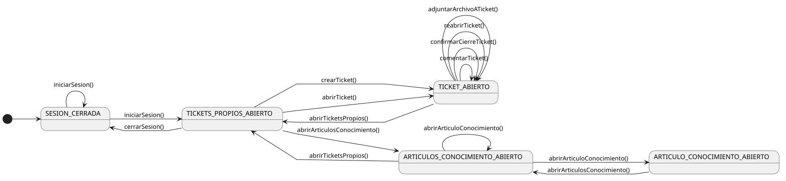
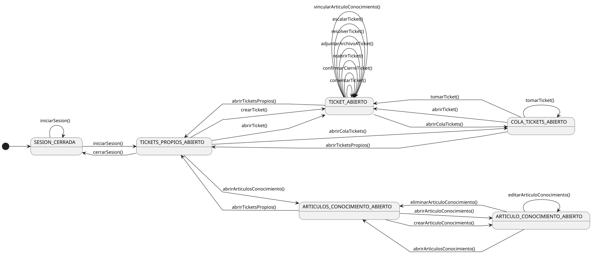
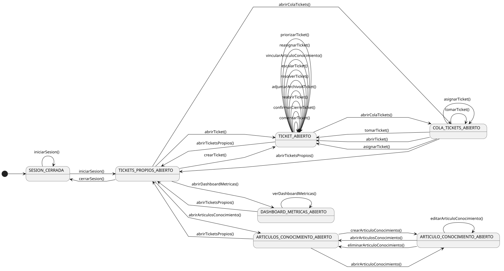
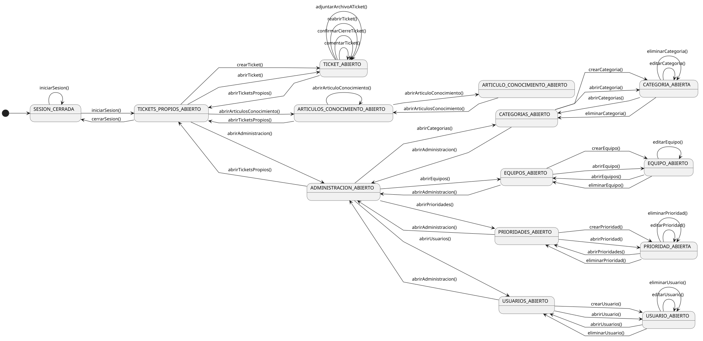

[HelpDesk](../README.md) / [Fase de Inicio](README.md)

# Diagramas de Contexto

### Solicitante

<table>
<tr><td align="center">

</td></tr>
<tr><td align="center"><i><a href="../../puml/01-fase-inicio/diagramas-contexto/actor-solicitante.puml">Código fuente</a></i></td></tr>
</table>

### Agente de Soporte

*Incluye toda la navegación de Solicitante (arriba), más la Cola de Tickets y la escritura sobre Artículos de Conocimiento.*

<table>
<tr><td align="center">

</td></tr>
<tr><td align="center"><i><a href="../../puml/01-fase-inicio/diagramas-contexto/actor-agente-soporte.puml">Código fuente</a></i></td></tr>
</table>

### Supervisor

*Incluye toda la navegación de Agente de Soporte (arriba, y transitivamente de Solicitante), más Asignar/Reasignar Ticket, Priorizar Ticket y el Dashboard de Métricas.*

<table>
<tr><td align="center">

</td></tr>
<tr><td align="center"><i><a href="../../puml/01-fase-inicio/diagramas-contexto/actor-supervisor.puml">Código fuente</a></i></td></tr>
</table>

### Administrador del Sistema

*Incluye toda la navegación de Solicitante (arriba) — Administrador generaliza a Solicitante directamente, no a Agente de Soporte ni a Supervisor, así que no incluye Cola de Tickets ni Dashboard — más los cuatro CRUD de configuración (Categoría, Equipo, Prioridad, Usuario) agrupados bajo un menú de Administración.*

<table>
<tr><td align="center">

</td></tr>
<tr><td align="center"><i><a href="../../puml/01-fase-inicio/diagramas-contexto/actor-administrador.puml">Código fuente</a></i></td></tr>
</table>

## Decisiones de modelado (y por qué)

- **Diagrama de estados de navegación, no diagrama de contexto actor-sistema clásico.** Un diagrama de contexto UML/RUP tradicional (el actor como caja externa conectada a una única caja "Sistema") sería casi idéntico para los cuatro actores salvo el nombre, dado que este producto no integra con sistemas externos. Se optó por un diagrama de estados que muestra la navegación real de cada actor, mucho más informativo para un ejercicio de este alcance.
- **Convención de nombres `RECURSO(S)_ABIERTO(A)`.** Plural = listado, singular = detalle. Se reutiliza el mismo par de estados para "crear" y "abrir uno existente" (ambos aterrizan en el detalle), igual criterio que ya usa el catálogo de casos de uso para distinguir Ver de Listar.
- **Crear X aterriza en el detalle del elemento recién creado, no en el listado.** Ninguna de las 15 especificaciones de Crear/Editar/Eliminar del catálogo de Administrador deja explícito el destino final tras el éxito (solo dicen "muestra confirmación"); UC-03 Crear Ticket sí lo sugiere ("confirmación, con el ticket recién creado"), y ese criterio se generalizó al resto por consistencia.
- **Eliminar X con éxito navega al listado; si hay flujo de bloqueo (Categoría, Prioridad, Usuario en uso), la versión bloqueada es un self-loop sobre el detalle.** Los tres flujos alternativos de bloqueo documentan explícitamente que el rechazo ocurre *antes* de pedir confirmación, así que el actor nunca sale del detalle en ese caso. Eliminar Equipo no tiene flujo de bloqueo (la relación con Categoría/Agente es opcional), así que solo tiene la arista de éxito.
- **Las cinco especificaciones de "Eliminar" arrancan siempre desde el detalle, nunca desde el listado directamente** (UC-17, 25, 30, 35, 40 abren primero el Ver-X correspondiente) — se siguió ese orden en vez de asumir un botón de eliminar en la fila del listado.
- **Acciones sobre un Ticket abierto sin pantalla final documentada explícitamente (Confirmar Cierre, Reabrir, Resolver, Escalar, Priorizar) se modelan como self-loop sobre el estado de detalle.** Ninguna de esas cinco especificaciones narra un último paso de "muestra..."; se asumió el mismo patrón que sí está explícito en el resto de acciones sobre un Ticket abierto (Comentar, Adjuntar, Reasignar, Vincular Artículo), en vez de dejarlas sin destino. Es una decisión de modelado de este artefacto, no algo que las especificaciones de Elaboración digan literalmente — no se editaron esos documentos para no reabrir una fase ya cerrada.
- **Tomar Ticket (UC-11) y Asignar Ticket (UC-18) parten de la Cola sin abrir el detalle antes; Reasignar Ticket (UC-19) y Priorizar Ticket (UC-41) sí requieren el detalle ya abierto.** Diferencia real entre las especificaciones: UC-19 dice explícitamente "Ticket ya asignado" como precondición, mientras que UC-11/UC-18 describen al actor "localizando" el ticket en la cola. Ambos casos con condición de carrera (otro agente se adelanta) vuelven a la Cola actualizada, también documentado explícitamente en sus flujos alternativos.
- **Login: la credencial inválida es un self-loop explícito** ("vuelve al paso 2" en el flujo alternativo de UC-01) sobre `SESION_CERRADA`, no una interpretación — es de los pocos casos donde la especificación ya lo decía literalmente.
- **Ver/Listar Artículo de Conocimiento pierde su self-loop de "visibilidad denegada" al pasar de Solicitante a Agente de Soporte.** El flujo alternativo de UC-09 que deniega el acceso a artículos Internos solo le ocurre a Solicitante; Agente ya ve Público e Interno, así que ese caso no aplica en su diagrama (ni en los de Supervisor o Administrador).
- **Menú "Administración" como estado intermedio que agrupa los cuatro CRUD de configuración**, en vez de colgar los cuatro listados directo del estado inicial — con cuatro recursos en vez de dos (como en el resto de diagramas), un estado intermedio evita saturar el estado de aristas de entrada y salida.
