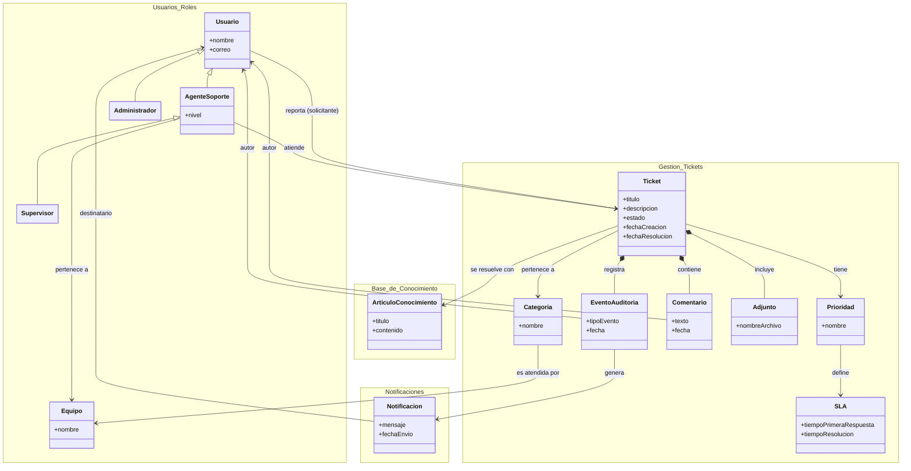

[HelpDesk](../../README.md) / [Fase de Inicio](../README.md) / [Modelo de Dominio](README.md)

# Diagrama de Clases — Modelo de Dominio

## Decisiones de modelado (y por qué)

- **Solicitante no es una clase.** Es un rol que cualquier `Usuario` asume al reportar un ticket — incluso un `AgenteSoporte` puede reportar uno. Modelarlo como clase aparte hubiera duplicado `Usuario` sin aportar comportamiento distinto.
- **`nivel` de `AgenteSoporte` existe por y para el escalamiento.** No clasifica tipos de ticket, clasifica capacidad de resolución: N1 atiende primero, y cuando el caso excede lo que puede resolver, se escala a un agente N2/N3. Es el dato del que depende a quién se le puede escalar un ticket.
- **`Supervisor` hereda de `AgenteSoporte`, no de `Usuario` directamente.** Para poder dirigir agentes necesita el mismo conocimiento técnico que ellos, y de hecho puede atender tickets él mismo — aunque en la práctica lo haga poco, siendo su rol principal supervisar carga de trabajo y SLA. Modelarlo como especialización de `AgenteSoporte` evita duplicar la asociación "atiende Ticket": la hereda.
- **Estado vive como atributo de `Ticket`, no como clase.** Su ciclo de vida sí es lo bastante rico como para modelarse aparte - ver el [Diagrama de Estados](diagrama-estados.md) - pero como máquina de estados, no como entidad relacionable aquí.
- **Escalamiento no tiene clase propia.** Se representa como un `EventoAuditoria` de tipo "Escalamiento" combinado con el cambio de `AgenteSoporte` asignado al ticket. Crear una clase `Escalamiento` habría sido una clase que en la práctica nadie consulta de forma independiente al ticket - justo el tipo de clase huérfana que conviene evitar.
- **`Ticket.fechaResolucion` es un atributo propio, no algo derivado en caliente de `EventoAuditoria`.** El objetivo (`SLA.tiempoResolucion`) es una política; `fechaResolucion` es el dato real de esta instancia. Reportes y Dashboard son feature prioritaria del MVP, así que este dato debe poder leerse directo del `Ticket` sin recorrer todo su historial de auditoría. El cumplimiento de SLA se calcula comparando ambos, no se almacena.
- **`Comentario`, `Adjunto` y `EventoAuditoria` son composición (`*--`) de `Ticket`.** No tienen sentido ni ciclo de vida propio fuera de su ticket: si el ticket se elimina, se eliminan con él.
- **`ArticuloConocimiento` es asociación simple, no agregación ni composición.** La agregación modela relaciones todo-parte (ej. una Biblioteca agrega Libros); un `Ticket` no está "compuesto de" artículos ni viceversa, son dos entidades independientes que se referencian entre sí. Por eso es asociación simple.
- **`Equipo` agrupa agentes; el `Supervisor` no tiene una relación "supervisa" aparte.** Como `Supervisor` ya hereda de `AgenteSoporte` (y por lo tanto hereda "pertenece a `Equipo`"), el equipo que supervisa es el mismo al que pertenece. Agregar una relación de supervisión aparte hubiera sido redundante.
- **La pertenencia a `Equipo` es opcional (`0..1`) tanto para `AgenteSoporte` como para `Categoria`.** Un agente puede existir antes de asignársele equipo, y una categoría puede no tener aún un equipo definido que la atienda — no queremos forzar esa asignación en el momento de crear cualquiera de los dos.
- **`Categoria` se conecta a `Equipo`, no `Ticket` directamente.** El enrutamiento a un equipo es una propiedad de la categoría (qué equipo la atiende), no algo que se decide ticket por ticket — así, todos los tickets de una categoría heredan el mismo enrutamiento sin duplicarlo.
