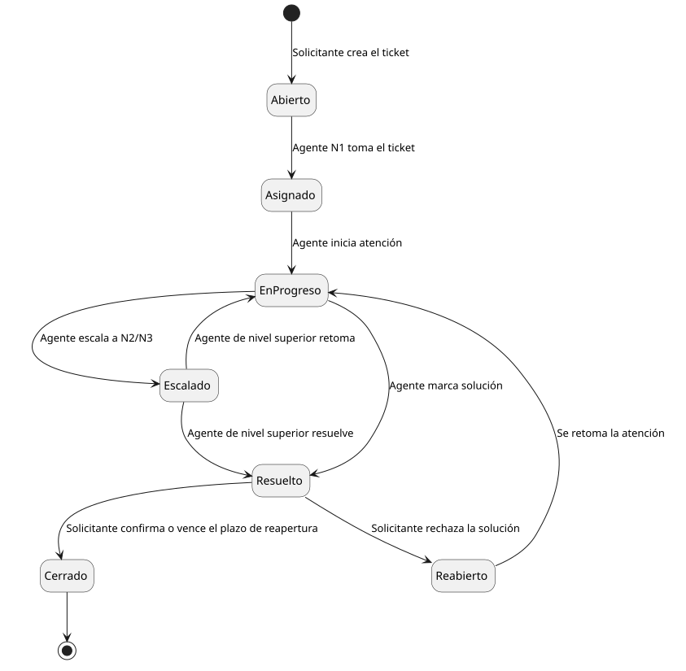

[HelpDesk](../../README.md) / [Fase de Inicio](../README.md) / [Modelo de Dominio](README.md)

# Diagrama de Estados — Ciclo de vida del Ticket

Complementa el [Diagrama de Clases](diagrama-clases.md): cómo cambia el atributo `estado` de un `Ticket` a lo largo del tiempo.

<table>
<tr><td align="center">

</td></tr>
<tr><td align="center"><i><a href="../../../puml/01-fase-inicio/modelo-dominio/diagrama-estados.puml">Código fuente</a></i></td></tr>
</table>

## Decisiones de modelado (y por qué)

- **El estado se modela como máquina de estados, no como clase relacionable.** En el [Diagrama de Clases](diagrama-clases.md), `estado` es un simple atributo de `Ticket`. Su ciclo de vida es lo bastante rico (transiciones condicionadas por rol y evento) como para merecer un diagrama propio, pero eso no lo convierte en una entidad con identidad propia dentro del modelo de dominio.
- **`Escalado` no implica cambio de clase ni de propietario del ticket**, solo de estado y de agente asignado - coherente con que `Escalamiento` tampoco es una clase en el Diagrama de Clases.
- **`Reabierto` existe como estado propio** (en vez de volver directo a `EnProgreso`) porque distinguirlo permite medir por separado cuántos tickets se reabren, una métrica de calidad de resolución que la Organización adoptante puede querer auditar.
- **Priorizar un ticket (confirmar `Ticket.prioridadConfirmada`) no es una transición de este diagrama.** Es ortogonal al ciclo de vida: un ticket puede estar en `Abierto` esté o no priorizado, igual que puede estarlo con cualquier `Categoria`. No introduce un estado nuevo, mismo criterio que ya se aplicó con `Escalado` — cambia un atributo, no la máquina de estados.
