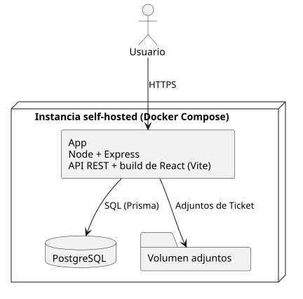

[HelpDesk](../README.md) / [Fase de Elaboración](README.md) / Decisión de Arquitectura

# Decisión de Arquitectura y Stack Tecnológico

Cierra el hueco que el Documento de Visión dejó deliberadamente abierto (sección 4.1: *"en esta fase no se fija arquitectura ni stack tecnológico"*) y resuelve **R-10** (despliegue self-hosted sin evaluar), el riesgo de mayor exposición de la Lista de Riesgos.

## Restricciones que ya venían dadas

No es una elección libre — el Documento de Visión (sección 6) y el Modelo de Dominio ya fijaban condiciones que el stack tiene que cumplir:

- **Self-hosted**: la organización adoptante despliega su propia instancia, sin depender de un proveedor SaaS ni de servicios propietarios de terceros para funcionar.
- **Portabilidad**: instalable en un entorno nuevo sin dependencias ocultas de infraestructura específica.
- **Acceso vía navegador estándar**, sin cliente de escritorio.

## Decisión

| Componente | Elección | Por qué |
|---|---|---|
| Frontend | React + Vite | Preferencia del autor. SPA servida como archivos estáticos — no necesita su propio servidor ni runtime en producción, lo que simplifica el self-hosted. |
| Backend | Node.js + Express | Preferencia del autor (Node); Express por ser el framework REST más simple y ubicuo del ecosistema — para una API que en el MVP es mayormente CRUD + autenticación, no hace falta algo más opinado (NestJS) ni más especializado (Fastify). |
| Base de datos | PostgreSQL | Preferencia del autor. Encaja bien con el Modelo de Dominio: relaciones claras (`Ticket`, `Usuario`, `Equipo`...), sin necesidad de las garantías de un motor NoSQL. |
| Acceso a datos | Prisma (ORM) | Migraciones versionadas desde el primer commit del esquema — importante porque el Modelo de Dominio ya evolucionó varias veces durante Inicio (`Equipo`, `prioridadConfirmada`, `fechaLimiteReapertura`); tipado de las consultas reduce errores al traducir las 14 clases del dominio a tablas. |
| Autenticación | JWT en cookie `httpOnly` | Resuelve R-03 / [UC-01](especificacion-casos-uso/acceso/UC-01-iniciar-sesion.md): cuentas propias, sin SSO/LDAP por ahora. `httpOnly` evita que el token sea legible por JavaScript (mitiga XSS) — más seguro que guardarlo en `localStorage`, que es la alternativa más común pero más débil. |
| Empaquetado | Un único contenedor Docker (Express sirve la API **y** el build estático de React) + un contenedor de PostgreSQL, orquestados con Docker Compose | Resuelve R-10 directamente. Un solo contenedor de aplicación (en vez de separar frontend/backend en dos) minimiza las piezas que la organización adoptante tiene que instalar y mantener — coherente con que el self-hosted es el diferenciador central del producto, no debería ser complicado de operar. |
| Almacenamiento de adjuntos | Sistema de archivos local, en un volumen de Docker montado en el contenedor de la app | Resuelve la decisión que dejó abierta [UC-42 Adjuntar Archivo a Ticket](especificacion-casos-uso/tickets/UC-42-adjuntar-archivo-ticket.md). Un servicio de almacenamiento de objetos (S3 o compatible) sería más robusto para escalar, pero introduce una dependencia externa que choca directo con la restricción de self-hosted de más arriba — la organización adoptante tendría que operar o contratar un segundo servicio solo para archivos. Un volumen de Docker es la opción que no agrega piezas nuevas al despliegue. |

<table>
<tr><td align="center">

</td></tr>
<tr><td align="center"><i><a href="../../puml/02-fase-elaboracion/arquitectura-despliegue.puml">Código fuente</a></i></td></tr>
</table>

## Consecuencias

- **JavaScript, no TypeScript.** Es la preferencia explícita del autor. Con 14 clases de dominio y varias relaciones no triviales (`Equipo` opcional, `Prioridad`↔`SLA` 1 a 1), TypeScript habría atrapado errores de forma más temprana — es un trade-off consciente, no una limitación técnica del stack. Se puede reconsiderar en Construcción si el proyecto lo empieza a pedir.
- **Un solo contenedor de aplicación** simplifica la instalación pero acopla el ciclo de release de frontend y backend — aceptable para un producto self-hosted de este tamaño; no lo sería si el plan fuera escalar frontend y backend por separado.
- **Prisma** impone su propio lenguaje de esquema (`schema.prisma`) — el Modelo de Diseño (próximo artefacto de Elaboración) se traduce a ese esquema, no a SQL directo.
- **El volumen de adjuntos vive y se respalda junto con el contenedor de la app, no junto a PostgreSQL.** La Organización adoptante que planifique backups tiene que incluir ambos — la base de datos y el volumen — o perderá los archivos aunque conserve los datos. Es responsabilidad de operación, no del producto; se documentará en el manual de instalación (Fase de Transición).
- **El tamaño máximo por archivo y los tipos permitidos son configuración de la instancia, no un valor fijo del producto** — mismo criterio que el Plazo de Reapertura: HelpDesk fija que la validación existe, la Organización adoptante fija los números exactos.

## Estado

Con esta decisión, R-10 pasa a estar cerrado (ver [Lista de Riesgos](../01-fase-inicio/lista-riesgos.md)) y la primera iteración de Elaboración queda completa: los 7 casos de uso significativos detallados + esta decisión de arquitectura.
