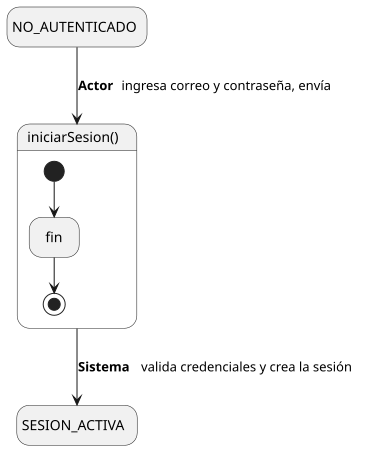
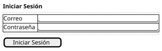

[HelpDesk](../../../README.md) / [Fase de Elaboración](../../README.md) / [Especificación de Casos de Uso](../README.md) / [Acceso](README.md)

# UC-01 · Iniciar Sesión

| Campo | Valor |
|---|---|
| Actor principal | Solicitante (base — todo actor lo hereda) |
| Precondición | El actor tiene una cuenta (`Usuario`) registrada en la instancia y no tiene ya una sesión activa |
| Postcondición (éxito) | Se crea una sesión activa asociada al `Usuario`; el Sistema conoce su rol para autorizar el resto de casos de uso |
| Postcondición (fallo) | No se crea sesión; el Sistema informa que las credenciales son incorrectas |

<table>
<tr><td align="center">

</td></tr>
<tr><td align="center"><i><a href="../../../../puml/02-fase-elaboracion/especificacion-casos-uso/acceso/UC01-iniciar-sesion.puml">Código fuente</a></i></td></tr>
</table>

### Wireframe

<table>
<tr><td align="center">

</td></tr>
<tr><td align="center"><i><a href="../../../../puml/02-fase-elaboracion/especificacion-casos-uso/acceso/UC01-iniciar-sesion-wireframe.puml">Código fuente</a></i></td></tr>
</table>

### Flujo básico

1. El actor accede a la pantalla de inicio de sesión.
2. El Sistema muestra el formulario: correo y contraseña.
3. El actor completa sus credenciales y las envía.
4. El Sistema valida las credenciales contra el `Usuario` registrado.
5. El Sistema crea una sesión activa asociada a ese `Usuario`.
6. El Sistema redirige al actor a su vista principal, según su rol.

### Flujos alternativos

- **FA-1 — Credenciales incorrectas (paso 4):** el Sistema muestra un mensaje de error genérico — no distingue entre "correo no existe" y "contraseña incorrecta", para no revelar qué correos están registrados — y vuelve al paso 2.

### Requisitos especiales

- Las contraseñas se almacenan con hash, nunca en texto plano. Es detalle de implementación (Diseño/Construcción), no cambia este flujo, pero queda anotado aquí porque es la primera vez que `Usuario` maneja un dato sensible.

### Reglas de negocio relacionadas

- **Resuelve R-03**: el mecanismo de autenticación es cuentas propias del sistema (correo + contraseña) — no SSO/LDAP. Consistente con el Documento de Visión (4.3), que deja esa integración como extensión futura, no requisito de esta versión.
- **Gap detectado al detallar este caso de uso: no hay recuperación de contraseña autoservicio.** No hay un caso de uso "Recuperar Contraseña" en el catálogo. Para esta versión, un `Usuario` que pierde su contraseña depende de que un Administrador se la restablezca vía `Editar Usuario` (UC-39) — no se agrega un caso de uso nuevo para esto ahora porque no está en el alcance de la primera iteración; queda anotado para revisar si hace falta antes de Construcción.
