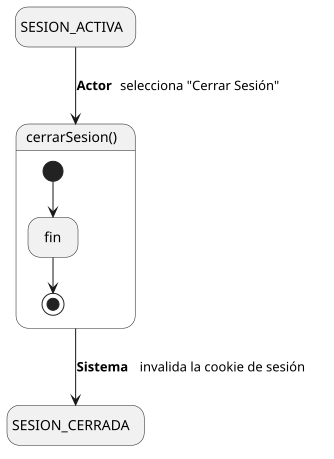
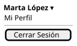

[HelpDesk](../../../README.md) / [Fase de Elaboración](../../README.md) / [Especificación de Casos de Uso](../README.md) / [Acceso](README.md)

# UC-02 · Cerrar Sesión

| Campo | Valor |
|---|---|
| Actor principal | Solicitante (base — todo actor lo hereda) |
| Precondición | El actor tiene una sesión activa |
| Postcondición (éxito) | La sesión del actor se cierra; el Sistema invalida la cookie de autenticación |
| Postcondición (fallo) | — (no aplica; cerrar sesión no tiene ninguna validación que pueda rechazarlo) |

<table>
<tr><td align="center">

</td></tr>
<tr><td align="center"><i><a href="../../../../puml/02-fase-elaboracion/especificacion-casos-uso/acceso/UC02-cerrar-sesion.puml">Código fuente</a></i></td></tr>
</table>

### Wireframe

<table>
<tr><td align="center">

</td></tr>
<tr><td align="center"><i><a href="../../../../puml/02-fase-elaboracion/especificacion-casos-uso/acceso/UC02-cerrar-sesion-wireframe.puml">Código fuente</a></i></td></tr>
</table>

### Flujo básico

1. El actor selecciona "Cerrar Sesión" desde el menú de usuario.
2. El Sistema invalida la cookie `httpOnly` que contiene el JWT de la sesión.
3. El Sistema redirige al actor a la pantalla de inicio de sesión ([UC-01](UC-01-iniciar-sesion.md)).

### Flujos alternativos

_(ninguno — no hay ninguna validación que pueda bloquear este flujo)_

### Requisitos especiales

- **El JWT es stateless, sin lista de revocación en el servidor** (ver [Decisión de Arquitectura](../../arquitectura.md)). Cerrar sesión borra la cookie en el navegador, pero el token en sí seguiría siendo técnicamente válido hasta su expiración natural si alguien lo hubiera capturado antes de este momento. Es una limitación aceptada del esquema elegido, no algo que este caso de uso deba resolver — mismo tipo de nota que el hash de contraseñas en [UC-01](UC-01-iniciar-sesion.md).

### Reglas de negocio relacionadas

- **Caso de uso simétrico a [UC-01 Iniciar Sesión](UC-01-iniciar-sesion.md)**: mismo mecanismo de sesión (JWT en cookie `httpOnly`), en sentido inverso.
- **No hay un caso de uso de "cerrar todas las sesiones activas"** (útil si un token fue robado) — fuera de alcance de esta versión, mismo criterio de alcance mínimo ya aplicado a otros gaps del catálogo (p. ej. "Eliminar Comentario", "Desvincular Artículo").
