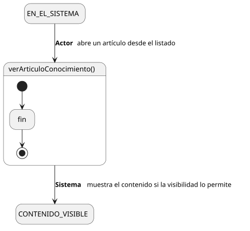
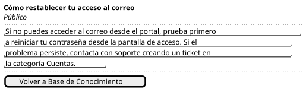

[HelpDesk](../../../README.md) / [Fase de Elaboración](../../README.md) / [Especificación de Casos de Uso](../README.md) / [Base de Conocimiento](README.md)

# UC-09 · Ver Artículo de Conocimiento

| Campo | Valor |
|---|---|
| Actor principal | Solicitante |
| Precondición | El `ArticuloConocimiento` existe |
| Postcondición (éxito) | El Sistema muestra el título y contenido del artículo, si su `visibilidad` es accesible para el actor |
| Postcondición (fallo) | El Sistema deniega el acceso; no se muestra el contenido |

<table>
<tr><td align="center">

</td></tr>
<tr><td align="center"><i><a href="../../../../puml/02-fase-elaboracion/especificacion-casos-uso/base-conocimiento/UC09-ver-articulo-conocimiento.puml">Código fuente</a></i></td></tr>
</table>

### Wireframe

<table>
<tr><td align="center">

</td></tr>
<tr><td align="center"><i><a href="../../../../puml/02-fase-elaboracion/especificacion-casos-uso/base-conocimiento/UC09-ver-articulo-conocimiento-wireframe.puml">Código fuente</a></i></td></tr>
</table>

### Flujo básico

1. El actor abre un artículo desde el listado ([UC-10](UC-10-listar-articulos-conocimiento.md)) o un enlace directo.
2. El Sistema verifica la `visibilidad` del artículo contra el rol del actor.
3. El Sistema muestra el título y el contenido del artículo.

### Flujos alternativos

- **FA-1 — Artículo `Interno` visto por un Solicitante puro (paso 2):** el Sistema deniega el acceso y no revela el contenido.

### Reglas de negocio relacionadas

- **La regla de visibilidad ya estaba capturada en el [Modelo de Dominio](../../../01-fase-inicio/modelo-dominio/README.md#reglas-de-negocio-capturadas-para-casos-de-uso) desde la Fase de Inicio** — este caso de uso es el primero en ejercitarla: Solicitante solo ve artículos `Público`; Agente de Soporte, Supervisor y Administrador ven `Público` **e** `Interno`, por ser personal técnico.
- Cierra la última parte de **R-07** (complejidad de visibilidad) que quedaba sin validar por ningún caso de uso detallado — ver [Lista de Riesgos](../../../01-fase-inicio/lista-riesgos.md).
