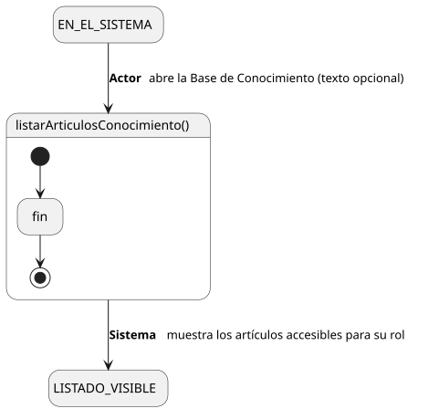

[HelpDesk](../../../README.md) / [Fase de Elaboración](../../README.md) / [Especificación de Casos de Uso](../README.md) / [Base de Conocimiento](README.md)

# UC-10 · Listar Artículos de Conocimiento

| Campo | Valor |
|---|---|
| Actor principal | Solicitante |
| Precondición | — (ninguna) |
| Postcondición (éxito) | El Sistema muestra los artículos cuya `visibilidad` es accesible para el actor, opcionalmente filtrados por un texto de búsqueda. No cambia ningún dato — es una consulta |
| Postcondición (fallo) | — (no aplica; es una consulta de solo lectura) |

<table>
<tr><td align="center">

</td></tr>
<tr><td align="center"><i><a href="../../../../puml/02-fase-elaboracion/especificacion-casos-uso/base-conocimiento/UC10-listar-articulos-conocimiento.puml">Código fuente</a></i></td></tr>
</table>

### Wireframe

<table>
<tr><td align="center">

</td></tr>
<tr><td align="center"><i><a href="../../../../puml/02-fase-elaboracion/especificacion-casos-uso/base-conocimiento/UC10-listar-articulos-conocimiento-wireframe.puml">Código fuente</a></i></td></tr>
</table>

### Flujo básico

1. El actor abre "Base de Conocimiento".
2. El actor, opcionalmente, escribe un texto de búsqueda.
3. El Sistema busca artículos cuyo título o contenido coincida con el texto (si lo hay), filtrando por `visibilidad` accesible al rol del actor.
4. El Sistema muestra el listado: título y visibilidad de cada artículo.
5. El actor selecciona uno para ver el detalle completo ([UC-09](UC-09-ver-articulo-conocimiento.md)).

### Flujos alternativos

_(ninguno — es una consulta sin ramas de validación)_

### Reglas de negocio relacionadas

- Mismo criterio de visibilidad que [UC-09](UC-09-ver-articulo-conocimiento.md): Solicitante solo ve `Público`; Agente de Soporte, Supervisor y Administrador ven `Público` e `Interno`.
- **La búsqueda es un filtro de texto simple sobre título y contenido, no un motor de búsqueda de texto completo (ej. Elasticsearch).** Evita introducir una dependencia adicional en un producto self-hosted — se puede reconsiderar en Construcción si el volumen de artículos lo justifica.
