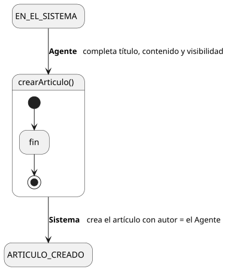
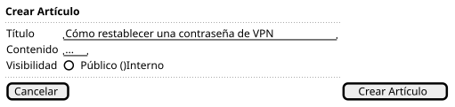

[HelpDesk](../../../README.md) / [Fase de Elaboración](../../README.md) / [Especificación de Casos de Uso](../README.md) / [Base de Conocimiento](README.md)

# UC-15 · Crear Artículo de Conocimiento

| Campo | Valor |
|---|---|
| Actor principal | Agente de Soporte |
| Precondición | El actor está autenticado con rol Agente de Soporte (o superior, por herencia) |
| Postcondición (éxito) | Se crea un `ArticuloConocimiento` con título, contenido y visibilidad indicados, con autor = el actor |
| Postcondición (fallo) | No se crea ningún `ArticuloConocimiento`; el Sistema muestra los errores de validación |

<table>
<tr><td align="center">

</td></tr>
<tr><td align="center"><i><a href="../../../../puml/02-fase-elaboracion/especificacion-casos-uso/base-conocimiento/UC15-crear-articulo-conocimiento.puml">Código fuente</a></i></td></tr>
</table>

### Wireframe

<table>
<tr><td align="center">

</td></tr>
<tr><td align="center"><i><a href="../../../../puml/02-fase-elaboracion/especificacion-casos-uso/base-conocimiento/UC15-crear-articulo-conocimiento-wireframe.puml">Código fuente</a></i></td></tr>
</table>

### Flujo básico

1. El Agente selecciona "Crear Artículo".
2. El Sistema muestra el formulario: título, contenido, visibilidad (Público / Interno).
3. El Agente completa los campos y confirma.
4. El Sistema valida que el título y el contenido no estén vacíos.
5. El Sistema crea el `ArticuloConocimiento`, con autor = el actor.
6. El Sistema muestra la confirmación.

### Flujos alternativos

- **FA-1 — Validación fallida (paso 4):** el Sistema muestra el error junto al campo y vuelve al paso 3, conservando lo ya ingresado.

### Reglas de negocio relacionadas

- **Gap detectado al detallar este caso de uso: `ArticuloConocimiento` no tenía relación `autor` en el Modelo de Dominio.** A diferencia de `Comentario` y `Adjunto`, que ya la tenían, `ArticuloConocimiento` solo registraba título, contenido y visibilidad — sin saber quién lo escribió no hay forma de mostrar autoría en la Base de Conocimiento. Agregada al [Diagrama de Clases](../../../01-fase-inicio/modelo-dominio/diagrama-clases.md).
- **Este caso de uso no genera `EventoAuditoria`.** `EventoAuditoria` es composición exclusiva de `Ticket` en el Modelo de Dominio; extenderla a `ArticuloConocimiento` exigiría una relación estructural nueva que ningún requisito del Documento de Visión pide (la trazabilidad de 3.4/7 es específicamente sobre tickets, mismo criterio ya fijado en [UC-21](../categoria/UC-21-crear-categoria.md)). Con el `autor` agregado alcanza para la trazabilidad mínima que necesita este caso de uso.
