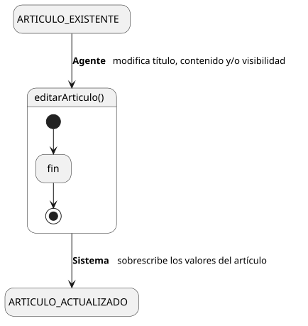
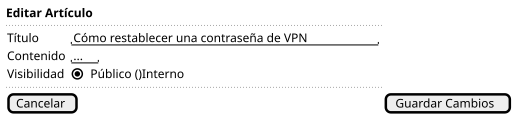

[HelpDesk](../../../README.md) / [Fase de Elaboración](../../README.md) / [Especificación de Casos de Uso](../README.md) / [Base de Conocimiento](README.md)

# UC-16 · Editar Artículo de Conocimiento

| Campo | Valor |
|---|---|
| Actor principal | Agente de Soporte |
| Precondición | El `ArticuloConocimiento` existe |
| Postcondición (éxito) | Se actualizan título, contenido y/o visibilidad del `ArticuloConocimiento`, con los valores anteriores sobrescritos y sin conservar una versión previa |
| Postcondición (fallo) | El `ArticuloConocimiento` conserva sus valores anteriores; el Sistema muestra los errores de validación |

<table>
<tr><td align="center">

</td></tr>
<tr><td align="center"><i><a href="../../../../puml/02-fase-elaboracion/especificacion-casos-uso/base-conocimiento/UC16-editar-articulo-conocimiento.puml">Código fuente</a></i></td></tr>
</table>

### Wireframe

<table>
<tr><td align="center">

</td></tr>
<tr><td align="center"><i><a href="../../../../puml/02-fase-elaboracion/especificacion-casos-uso/base-conocimiento/UC16-editar-articulo-conocimiento-wireframe.puml">Código fuente</a></i></td></tr>
</table>

### Flujo básico

1. El Agente abre un artículo existente ([UC-09](UC-09-ver-articulo-conocimiento.md)).
2. El Agente selecciona "Editar Artículo".
3. El Sistema muestra el formulario precargado con los valores actuales.
4. El Agente modifica título, contenido y/o visibilidad, y confirma.
5. El Sistema valida que el título y el contenido no queden vacíos.
6. El Sistema actualiza el `ArticuloConocimiento`.
7. El Sistema muestra la confirmación.

### Flujos alternativos

- **FA-1 — Validación fallida (paso 5):** el Sistema muestra el error junto al campo y vuelve al paso 4, conservando lo ya editado.

### Reglas de negocio relacionadas

- **`ArticuloConocimiento` no necesita historial de versiones.** Resuelve la pregunta que el [Modelo de Dominio](../../../01-fase-inicio/modelo-dominio/README.md#pendiente-para-elaboración) dejaba explícitamente abierta ("confirmar o descartar... si `ArticuloConocimiento` necesita versión propia"): editar sobrescribe título y contenido sin conservar la versión anterior. A diferencia de `Ticket` (donde no se permite editar, precisamente para proteger la trazabilidad — ver "No existe Editar Ticket" en [Casos de Uso](../../../01-fase-inicio/casos-de-uso.md)), un artículo de conocimiento es un documento vivo que se espera mantener actualizado; versionarlo no responde a ningún requisito del Documento de Visión y sería alcance nuevo sin caso de uso que lo pida. Se puede reconsiderar en Construcción si el volumen de artículos lo justifica.
- **No se registra quién hizo la última edición ni cuándo.** Consistente con la decisión de [UC-15](UC-15-crear-articulo-conocimiento.md) de no generar `EventoAuditoria` para esta entidad — solo se conserva el `autor` original de creación.
- **Cualquier Agente de Soporte puede editar cualquier artículo, no solo su autor.** Es una base de conocimiento compartida del equipo técnico, mismo modelo de confianza que ya aplica a tomar tickets de una cola compartida (ver [UC-11](../tickets/UC-11-tomar-ticket.md)).
