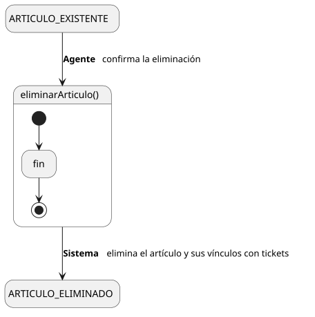

[HelpDesk](../../../README.md) / [Fase de Elaboración](../../README.md) / [Especificación de Casos de Uso](../README.md) / [Base de Conocimiento](README.md)

# UC-17 · Eliminar Artículo de Conocimiento

| Campo | Valor |
|---|---|
| Actor principal | Agente de Soporte |
| Precondición | El `ArticuloConocimiento` existe |
| Postcondición (éxito) | El `ArticuloConocimiento` se elimina del Sistema, junto con su vínculo con cualquier `Ticket` que lo referenciara |
| Postcondición (fallo) | El `ArticuloConocimiento` sigue existiendo |

<table>
<tr><td align="center">

</td></tr>
<tr><td align="center"><i><a href="../../../../puml/02-fase-elaboracion/especificacion-casos-uso/base-conocimiento/UC17-eliminar-articulo-conocimiento.puml">Código fuente</a></i></td></tr>
</table>

### Wireframe

<table>
<tr><td align="center">

</td></tr>
<tr><td align="center"><i><a href="../../../../puml/02-fase-elaboracion/especificacion-casos-uso/base-conocimiento/UC17-eliminar-articulo-conocimiento-wireframe.puml">Código fuente</a></i></td></tr>
</table>

### Flujo básico

1. El Agente abre un artículo existente ([UC-09](UC-09-ver-articulo-conocimiento.md)).
2. El Agente selecciona "Eliminar Artículo".
3. El Sistema pide confirmación.
4. El Agente confirma.
5. El Sistema elimina el `ArticuloConocimiento` y su vínculo con cualquier `Ticket` que lo referenciara.
6. El Sistema muestra la confirmación.

### Flujos alternativos

_(ninguno adicional — la confirmación cubre la única validación de este flujo)_

### Reglas de negocio relacionadas

- **Eliminar un artículo retira también su asociación con los `Ticket` que lo tenían vinculado ([UC-43](UC-43-vincular-articulo-ticket.md)).** La relación `Ticket — ArticuloConocimiento` no sobrevive a la eliminación del artículo, para no dejar una referencia colgante. El historial de `EventoAuditoria` del ticket no se ve afectado — conserva el registro de que en su momento se vinculó un artículo, aunque el artículo ya no exista.
