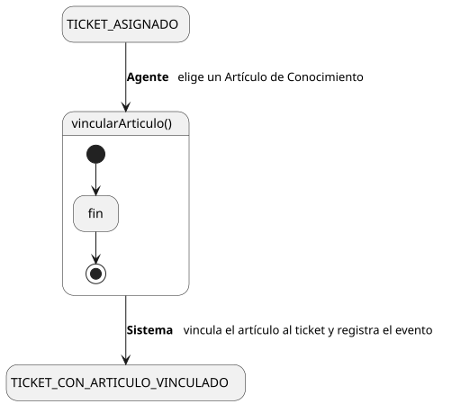
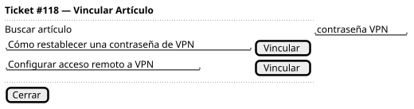

[HelpDesk](../../../README.md) / [Fase de Elaboración](../../README.md) / [Especificación de Casos de Uso](../README.md) / [Base de Conocimiento](README.md)

# UC-43 · Vincular Artículo de Conocimiento a Ticket

| Campo | Valor |
|---|---|
| Actor principal | Agente de Soporte |
| Precondición | El `Ticket` está asignado al actor (estado `Asignado`, `EnProgreso` o `Reabierto`) y el `ArticuloConocimiento` existe |
| Postcondición (éxito) | Se crea la asociación entre el `Ticket` y el `ArticuloConocimiento` elegido; se registra un `EventoAuditoria` |
| Postcondición (fallo) | El `Ticket` no queda vinculado a ningún artículo nuevo |

<table>
<tr><td align="center">

</td></tr>
<tr><td align="center"><i><a href="../../../../puml/02-fase-elaboracion/especificacion-casos-uso/base-conocimiento/UC43-vincular-articulo-ticket.puml">Código fuente</a></i></td></tr>
</table>

### Wireframe

<table>
<tr><td align="center">

</td></tr>
<tr><td align="center"><i><a href="../../../../puml/02-fase-elaboracion/especificacion-casos-uso/base-conocimiento/UC43-vincular-articulo-ticket-wireframe.puml">Código fuente</a></i></td></tr>
</table>

### Flujo básico

1. El Agente, atendiendo un ticket asignado a él ([UC-04](../tickets/UC-04-ver-ticket.md)), identifica un artículo relevante en la Base de Conocimiento ([UC-10](UC-10-listar-articulos-conocimiento.md)).
2. El Agente selecciona "Vincular Artículo" desde el ticket.
3. El Sistema muestra un buscador de artículos.
4. El Agente localiza el artículo y confirma el vínculo.
5. El Sistema verifica que el ticket siga asignado al actor.
6. El Sistema crea la asociación entre el `Ticket` y el `ArticuloConocimiento`.
7. El Sistema registra un `EventoAuditoria` de tipo "Vinculación", citando el artículo.
8. El Sistema lo agrega a la lista de artículos vinculados visible en UC-04.

### Flujos alternativos

- **FA-1 — El ticket dejó de estar asignado al actor entre que se abrió y se confirmó (paso 5):** condición de carrera, mismo criterio que [UC-18](../tickets/UC-18-asignar-ticket.md)/[UC-19](../tickets/UC-19-reasignar-ticket.md) — el Sistema informa que ya no puede vincular y vuelve al detalle del ticket actualizado.
- **FA-2 — El artículo ya estaba vinculado a ese ticket (paso 6):** el Sistema no duplica el vínculo, informa que ya existe y vuelve al paso 3.

### Reglas de negocio relacionadas

- **La asociación `Ticket — ArticuloConocimiento` no tiene atributos propios** (a diferencia de `Comentario`/`Adjunto`, que sí llevan `autor` y `fecha`) — por eso el vínculo se registra vía `EventoAuditoria` en el `Ticket`, el mismo mecanismo que ya usan Asignar/Escalar/Resolver para acciones que cambian o anotan un ticket sin tener una entidad propia que las capture.
- **Vincular no genera notificación propia** — mismo criterio de alcance mínimo que [Comentar Ticket](../tickets/UC-06-comentar-ticket.md): no tiene una consecuencia con plazo, el Solicitante lo ve la próxima vez que abre el ticket.
- **No hay "Desvincular Artículo" en el catálogo** — mismo criterio de alcance mínimo ya aplicado a `Comentario` y `Adjunto`: lo que se vincula como referencia de solución queda parte del historial del ticket. Ver también [UC-17](UC-17-eliminar-articulo-conocimiento.md) sobre qué pasa con el vínculo si el artículo se elimina.
