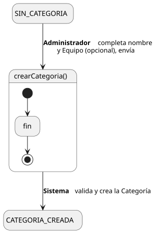
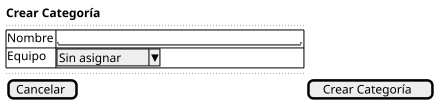

[HelpDesk](../../../README.md) / [Fase de Elaboración](../../README.md) / [Especificación de Casos de Uso](../README.md) / [Categoría](README.md)

# UC-21 · Crear Categoría

| Campo | Valor |
|---|---|
| Actor principal | Administrador del Sistema |
| Precondición | El actor está autenticado con rol Administrador |
| Postcondición (éxito) | Se crea una `Categoria` con el nombre indicado, opcionalmente asociada a un `Equipo` |
| Postcondición (fallo) | No se crea ninguna `Categoria`; el Sistema muestra los errores de validación |

<table>
<tr><td align="center">

</td></tr>
<tr><td align="center"><i><a href="../../../../puml/02-fase-elaboracion/especificacion-casos-uso/categoria/UC21-crear-categoria.puml">Código fuente</a></i></td></tr>
</table>

### Wireframe

<table>
<tr><td align="center">

</td></tr>
<tr><td align="center"><i><a href="../../../../puml/02-fase-elaboracion/especificacion-casos-uso/categoria/UC21-crear-categoria-wireframe.puml">Código fuente</a></i></td></tr>
</table>

### Flujo básico

1. El Administrador selecciona "Crear Categoría".
2. El Sistema muestra el formulario: nombre, Equipo que la atiende (opcional).
3. El Administrador completa el nombre y, opcionalmente, selecciona un Equipo.
4. El Administrador envía el formulario.
5. El Sistema valida que el nombre no esté vacío y que no exista ya una `Categoria` con ese nombre.
6. El Sistema crea la `Categoria`.
7. El Sistema muestra la confirmación.

### Flujos alternativos

- **FA-1 — Validación fallida o nombre duplicado (paso 5):** el Sistema muestra el error correspondiente junto al campo y vuelve al paso 3, conservando lo ya ingresado.

### Reglas de negocio relacionadas

- **Dejar "Equipo" sin asignar es una opción válida, no un error.** Es la relación opcional (`0..1`) documentada en el [Diagrama de Clases](../../../01-fase-inicio/modelo-dominio/diagrama-clases.md). Una `Categoria` creada así no aparecerá en ninguna cola hasta que se le asigne un Equipo vía [UC-24 Editar Categoría](../../../01-fase-inicio/casos-de-uso.md) — mismo caso ya identificado en [UC-03, FA-2](../tickets/UC-03-crear-ticket.md#flujos-alternativos) y en [UC-14](../tickets/UC-14-listar-cola-de-tickets.md).
- **Este caso de uso no genera `EventoAuditoria`.** A diferencia de `Ticket`, las entidades de configuración (`Categoria`, `Equipo`, `Prioridad`, `Usuario`) no están modeladas con auditoría propia — el requisito de trazabilidad del Documento de Visión (3.4, 7) es específicamente sobre tickets, no sobre configuración de la instancia. Es una decisión deliberada, no un olvido: vale para este caso de uso y para el resto de los CRUD de configuración que se detallen después (mismo patrón — `Equipo`, `Prioridad`, `Usuario`).

### Nota para los próximos CRUD

Este caso de uso es la plantilla que fija el Plan de Desarrollo: los `Crear`/`Editar` de `Equipo`, `Prioridad` y `Usuario` siguen esta misma estructura (formulario → validar → crear/actualizar → confirmar), y los `Ver`/`Listar`/`Eliminar` son variaciones aún más simples del mismo patrón (consulta o baja, sin flujos alternativos propios salvo validación). No hace falta re-justificar esa estructura en cada uno — solo las decisiones específicas de cada entidad (como la de SLA dentro de Prioridad).
