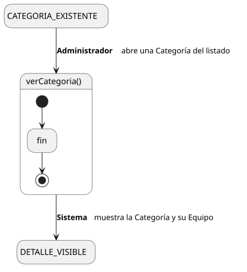
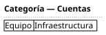

[HelpDesk](../../../README.md) / [Fase de Elaboración](../../README.md) / [Especificación de Casos de Uso](../README.md) / [Categoría](README.md)

# UC-22 · Ver Categoría

| Campo | Valor |
|---|---|
| Actor principal | Administrador del Sistema |
| Precondición | La `Categoria` existe |
| Postcondición (éxito) | El Sistema muestra el nombre de la `Categoria` y el `Equipo` que la atiende, si tiene uno asignado. No cambia ningún dato — es una consulta |
| Postcondición (fallo) | — (no aplica; es una consulta de solo lectura) |

<table>
<tr><td align="center">

</td></tr>
<tr><td align="center"><i><a href="../../../../puml/02-fase-elaboracion/especificacion-casos-uso/categoria/UC22-ver-categoria.puml">Código fuente</a></i></td></tr>
</table>

### Wireframe

<table>
<tr><td align="center">

</td></tr>
<tr><td align="center"><i><a href="../../../../puml/02-fase-elaboracion/especificacion-casos-uso/categoria/UC22-ver-categoria-wireframe.puml">Código fuente</a></i></td></tr>
</table>

### Flujo básico

1. El Administrador abre una Categoría desde el listado ([UC-23](UC-23-listar-categorias.md)).
2. El Sistema muestra el nombre de la `Categoria` y el `Equipo` que la atiende, si tiene uno asignado.

### Flujos alternativos

_(ninguno — es una consulta sin ramas de validación)_

### Reglas de negocio relacionadas

- **Si la Categoría no tiene Equipo asignado, el Sistema lo indica explícitamente** (p. ej. "Sin equipo asignado") en vez de dejarlo en blanco — mismo criterio ya usado en [Ver Equipo (UC-27)](../equipo/UC-27-ver-equipo.md). Recuerda la consecuencia ya documentada en [UC-03 (FA-2)](../tickets/UC-03-crear-ticket.md#flujos-alternativos) y [UC-14](../tickets/UC-14-listar-cola-de-tickets.md): sin Equipo, ningún ticket de esta Categoría llega a ninguna cola.
