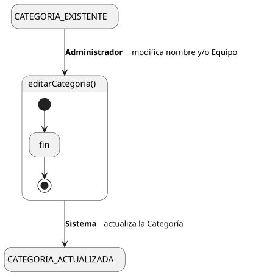
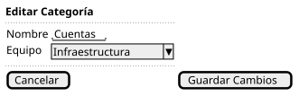

[HelpDesk](../../../README.md) / [Fase de Elaboración](../../README.md) / [Especificación de Casos de Uso](../README.md) / [Categoría](README.md)

# UC-24 · Editar Categoría

| Campo | Valor |
|---|---|
| Actor principal | Administrador del Sistema |
| Precondición | La `Categoria` existe |
| Postcondición (éxito) | Se actualiza el nombre de la `Categoria` y/o el `Equipo` que la atiende |
| Postcondición (fallo) | La `Categoria` conserva sus valores anteriores; el Sistema muestra los errores de validación |

<table>
<tr><td align="center">

</td></tr>
<tr><td align="center"><i><a href="../../../../puml/02-fase-elaboracion/especificacion-casos-uso/categoria/UC24-editar-categoria.puml">Código fuente</a></i></td></tr>
</table>

### Wireframe

<table>
<tr><td align="center">

</td></tr>
<tr><td align="center"><i><a href="../../../../puml/02-fase-elaboracion/especificacion-casos-uso/categoria/UC24-editar-categoria-wireframe.puml">Código fuente</a></i></td></tr>
</table>

### Flujo básico

1. El Administrador abre una Categoría existente ([UC-22](UC-22-ver-categoria.md)).
2. El Administrador selecciona "Editar Categoría".
3. El Sistema muestra el formulario precargado con el nombre y el `Equipo` actuales.
4. El Administrador modifica el nombre y/o el `Equipo`, y confirma.
5. El Sistema valida que el nombre no quede vacío ni duplicado.
6. El Sistema actualiza la `Categoria`.
7. El Sistema muestra la confirmación.

### Flujos alternativos

- **FA-1 — Validación fallida o nombre duplicado (paso 5):** el Sistema muestra el error junto al campo y vuelve al paso 4, conservando lo ya editado.

### Reglas de negocio relacionadas

- **Aquí es donde se asigna, cambia o retira el Equipo que atiende la Categoría** — decisión ya fijada en [UC-21 Crear Categoría](UC-21-crear-categoria.md): una Categoría creada sin Equipo se le asigna uno "vía UC-24 Editar Categoría".
