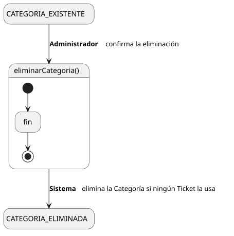

[HelpDesk](../../../README.md) / [Fase de Elaboración](../../README.md) / [Especificación de Casos de Uso](../README.md) / [Categoría](README.md)

# UC-25 · Eliminar Categoría

| Campo | Valor |
|---|---|
| Actor principal | Administrador del Sistema |
| Precondición | La `Categoria` existe y ningún `Ticket` la tiene asignada |
| Postcondición (éxito) | La `Categoria` se elimina |
| Postcondición (fallo) | La `Categoria` sigue existiendo; el Sistema informa por qué no se pudo eliminar |

<table>
<tr><td align="center">

</td></tr>
<tr><td align="center"><i><a href="../../../../puml/02-fase-elaboracion/especificacion-casos-uso/categoria/UC25-eliminar-categoria.puml">Código fuente</a></i></td></tr>
</table>

### Wireframe

<table>
<tr><td align="center">

</td></tr>
<tr><td align="center"><i><a href="../../../../puml/02-fase-elaboracion/especificacion-casos-uso/categoria/UC25-eliminar-categoria-wireframe.puml">Código fuente</a></i></td></tr>
</table>

### Flujo básico

1. El Administrador abre una Categoría existente ([UC-22](UC-22-ver-categoria.md)).
2. El Administrador selecciona "Eliminar Categoría".
3. El Sistema verifica que ningún `Ticket` tenga esta `Categoria` asignada.
4. El Sistema pide confirmación.
5. El Administrador confirma.
6. El Sistema elimina la `Categoria`.
7. El Sistema muestra la confirmación.

### Flujos alternativos

- **FA-1 — La Categoría está en uso (paso 3):** el Sistema rechaza la eliminación e informa cuántos `Ticket` la tienen asignada; no llega a pedir confirmación.

### Reglas de negocio relacionadas

- **Mismo criterio que [Eliminar Prioridad (UC-35)](../prioridad/UC-35-eliminar-prioridad.md):** `Ticket — Categoria` es una relación obligatoria en el [Modelo de Dominio](../../../01-fase-inicio/modelo-dominio/diagrama-clases.md) — todo `Ticket` tiene exactamente una — así que eliminarla dejaría tickets sin `Categoria`, violando esa obligatoriedad.
- **A diferencia de [Eliminar Equipo (UC-30)](../equipo/UC-30-eliminar-equipo.md), aquí no existe la opción de degradar a "sin Categoría".** `Categoria — Equipo` es opcional (una Categoría puede no tener Equipo), pero `Ticket — Categoria` no lo es — por eso Eliminar Equipo no está bloqueado y Eliminar Categoría sí.
