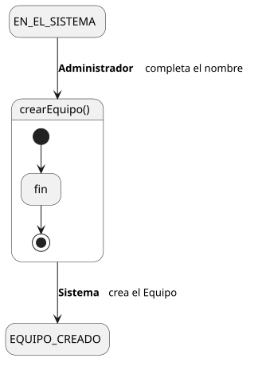
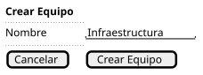

[HelpDesk](../../../README.md) / [Fase de Elaboración](../../README.md) / [Especificación de Casos de Uso](../README.md) / [Equipo](README.md)

# UC-26 · Crear Equipo

| Campo | Valor |
|---|---|
| Actor principal | Administrador del Sistema |
| Precondición | El actor está autenticado con rol Administrador |
| Postcondición (éxito) | Se crea un `Equipo` con el nombre indicado |
| Postcondición (fallo) | No se crea ningún `Equipo`; el Sistema muestra los errores de validación |

<table>
<tr><td align="center">

</td></tr>
<tr><td align="center"><i><a href="../../../../puml/02-fase-elaboracion/especificacion-casos-uso/equipo/UC26-crear-equipo.puml">Código fuente</a></i></td></tr>
</table>

### Wireframe

<table>
<tr><td align="center">

</td></tr>
<tr><td align="center"><i><a href="../../../../puml/02-fase-elaboracion/especificacion-casos-uso/equipo/UC26-crear-equipo-wireframe.puml">Código fuente</a></i></td></tr>
</table>

### Flujo básico

1. El Administrador selecciona "Crear Equipo".
2. El Sistema muestra el formulario: nombre.
3. El Administrador completa el nombre y envía el formulario.
4. El Sistema valida que el nombre no esté vacío y que no exista ya un `Equipo` con ese nombre.
5. El Sistema crea el `Equipo`.
6. El Sistema muestra la confirmación.

### Flujos alternativos

- **FA-1 — Validación fallida o nombre duplicado (paso 4):** el Sistema muestra el error correspondiente junto al campo y vuelve al paso 3, conservando lo ya ingresado.

### Reglas de negocio relacionadas

- **Este caso de uso no genera `EventoAuditoria`**, mismo criterio ya fijado en [UC-21 Crear Categoría](../categoria/UC-21-crear-categoria.md) para las entidades de configuración.
