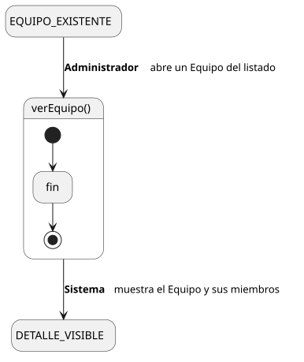
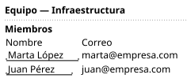

[HelpDesk](../../../README.md) / [Fase de Elaboración](../../README.md) / [Especificación de Casos de Uso](../README.md) / [Equipo](README.md)

# UC-27 · Ver Equipo

| Campo | Valor |
|---|---|
| Actor principal | Administrador del Sistema |
| Precondición | El `Equipo` existe |
| Postcondición (éxito) | El Sistema muestra el nombre del `Equipo` y los Agentes de Soporte que pertenecen a él. No cambia ningún dato — es una consulta |
| Postcondición (fallo) | — (no aplica; es una consulta de solo lectura) |

<table>
<tr><td align="center">

</td></tr>
<tr><td align="center"><i><a href="../../../../puml/02-fase-elaboracion/especificacion-casos-uso/equipo/UC27-ver-equipo.puml">Código fuente</a></i></td></tr>
</table>

### Wireframe

<table>
<tr><td align="center">

</td></tr>
<tr><td align="center"><i><a href="../../../../puml/02-fase-elaboracion/especificacion-casos-uso/equipo/UC27-ver-equipo-wireframe.puml">Código fuente</a></i></td></tr>
</table>

### Flujo básico

1. El Administrador abre un Equipo desde el listado ([UC-28](UC-28-listar-equipos.md)).
2. El Sistema muestra el nombre del `Equipo`.
3. El Sistema muestra los Agentes de Soporte cuyo `Equipo` es este.

### Flujos alternativos

_(ninguno — es una consulta sin ramas de validación)_

### Reglas de negocio relacionadas

- **La pertenencia de un Agente a este Equipo no se edita aquí.** Se modifica desde [Editar Usuario](../usuario/UC-39-editar-usuario.md), decisión ya fijada en el [Modelo de Casos de Uso](../../../01-fase-inicio/casos-de-uso.md) — este listado de miembros es de solo lectura.
- **Este detalle no muestra las Categorías atendidas por el Equipo.** Ese es un dato de la `Categoria`, no del `Equipo` — se consulta desde Ver/Editar Categoría, no aquí.
