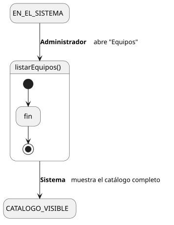
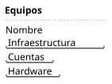

[HelpDesk](../../../README.md) / [Fase de Elaboración](../../README.md) / [Especificación de Casos de Uso](../README.md) / [Equipo](README.md)

# UC-28 · Listar Equipos

| Campo | Valor |
|---|---|
| Actor principal | Administrador del Sistema |
| Precondición | — (ninguna) |
| Postcondición (éxito) | El Sistema muestra el catálogo completo de `Equipo`, con su nombre. No cambia ningún dato — es una consulta |
| Postcondición (fallo) | — (no aplica; es una consulta de solo lectura) |

<table>
<tr><td align="center">

</td></tr>
<tr><td align="center"><i><a href="../../../../puml/02-fase-elaboracion/especificacion-casos-uso/equipo/UC28-listar-equipos.puml">Código fuente</a></i></td></tr>
</table>

### Wireframe

<table>
<tr><td align="center">

</td></tr>
<tr><td align="center"><i><a href="../../../../puml/02-fase-elaboracion/especificacion-casos-uso/equipo/UC28-listar-equipos-wireframe.puml">Código fuente</a></i></td></tr>
</table>

### Flujo básico

1. El Administrador abre "Equipos".
2. El Sistema muestra el listado completo: nombre de cada `Equipo`.
3. El Administrador selecciona uno para ver el detalle ([UC-27](UC-27-ver-equipo.md)).

### Flujos alternativos

_(ninguno — es una consulta sin ramas de validación)_

### Reglas de negocio relacionadas

- Ninguna adicional — mismo patrón de listado simple que el resto de los catálogos de configuración.
