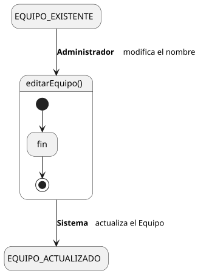
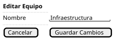

[HelpDesk](../../../README.md) / [Fase de Elaboración](../../README.md) / [Especificación de Casos de Uso](../README.md) / [Equipo](README.md)

# UC-29 · Editar Equipo

| Campo | Valor |
|---|---|
| Actor principal | Administrador del Sistema |
| Precondición | El `Equipo` existe |
| Postcondición (éxito) | Se actualiza el nombre del `Equipo` |
| Postcondición (fallo) | El `Equipo` conserva su nombre anterior; el Sistema muestra los errores de validación |

<table>
<tr><td align="center">

</td></tr>
<tr><td align="center"><i><a href="../../../../puml/02-fase-elaboracion/especificacion-casos-uso/equipo/UC29-editar-equipo.puml">Código fuente</a></i></td></tr>
</table>

### Wireframe

<table>
<tr><td align="center">

</td></tr>
<tr><td align="center"><i><a href="../../../../puml/02-fase-elaboracion/especificacion-casos-uso/equipo/UC29-editar-equipo-wireframe.puml">Código fuente</a></i></td></tr>
</table>

### Flujo básico

1. El Administrador abre un Equipo existente ([UC-27](UC-27-ver-equipo.md)).
2. El Administrador selecciona "Editar Equipo".
3. El Sistema muestra el formulario precargado con el nombre actual.
4. El Administrador modifica el nombre y confirma.
5. El Sistema valida que el nombre no quede vacío ni duplicado.
6. El Sistema actualiza el `Equipo`.
7. El Sistema muestra la confirmación.

### Flujos alternativos

- **FA-1 — Validación fallida o nombre duplicado (paso 5):** el Sistema muestra el error junto al campo y vuelve al paso 4, conservando lo ya editado.

### Reglas de negocio relacionadas

- **Este caso de uso solo modifica el nombre del Equipo** — no reasigna miembros ni categorías atendidas, mismo criterio que [UC-27](UC-27-ver-equipo.md): la pertenencia de un Agente se edita desde Editar Usuario, y qué Equipo atiende una Categoría se edita desde Editar Categoría.
