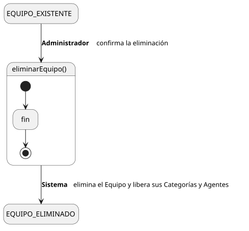
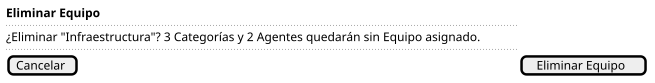

[HelpDesk](../../../README.md) / [Fase de Elaboración](../../README.md) / [Especificación de Casos de Uso](../README.md) / [Equipo](README.md)

# UC-30 · Eliminar Equipo

| Campo | Valor |
|---|---|
| Actor principal | Administrador del Sistema |
| Precondición | El `Equipo` existe |
| Postcondición (éxito) | El `Equipo` se elimina; las Categorías que atendía y los Agentes que pertenecían a él quedan sin Equipo asignado |
| Postcondición (fallo) | El `Equipo` sigue existiendo |

<table>
<tr><td align="center">

</td></tr>
<tr><td align="center"><i><a href="../../../../puml/02-fase-elaboracion/especificacion-casos-uso/equipo/UC30-eliminar-equipo.puml">Código fuente</a></i></td></tr>
</table>

### Wireframe

<table>
<tr><td align="center">

</td></tr>
<tr><td align="center"><i><a href="../../../../puml/02-fase-elaboracion/especificacion-casos-uso/equipo/UC30-eliminar-equipo-wireframe.puml">Código fuente</a></i></td></tr>
</table>

### Flujo básico

1. El Administrador abre un Equipo existente ([UC-27](UC-27-ver-equipo.md)).
2. El Administrador selecciona "Eliminar Equipo".
3. El Sistema pide confirmación, advirtiendo cuántas Categorías y Agentes quedarán sin Equipo asignado.
4. El Administrador confirma.
5. El Sistema elimina el `Equipo`, dejando sin Equipo asignado a las Categorías y Agentes que lo tenían.
6. El Sistema muestra la confirmación.

### Flujos alternativos

_(ninguno adicional — la confirmación cubre la única validación de este flujo)_

### Reglas de negocio relacionadas

- **Eliminar un Equipo no está bloqueado**, a diferencia de lo que se decide para [Prioridad](../prioridad/UC-35-eliminar-prioridad.md) y [Usuario](../usuario/UC-40-eliminar-usuario.md): `Categoria — Equipo` y `AgenteSoporte — Equipo` ya son relaciones opcionales en el [Modelo de Dominio](../../../01-fase-inicio/modelo-dominio/diagrama-clases.md), así que perder el Equipo es un estado válido que ya contemplan [UC-03 (FA-2)](../tickets/UC-03-crear-ticket.md#flujos-alternativos) y [UC-14](../tickets/UC-14-listar-cola-de-tickets.md) — no requiere ninguna estructura nueva.
