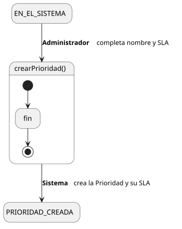
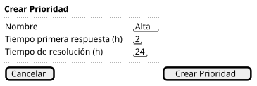

[HelpDesk](../../../README.md) / [Fase de Elaboración](../../README.md) / [Especificación de Casos de Uso](../README.md) / [Prioridad](README.md)

# UC-31 · Crear Prioridad

| Campo | Valor |
|---|---|
| Actor principal | Administrador del Sistema |
| Precondición | El actor está autenticado con rol Administrador |
| Postcondición (éxito) | Se crea una `Prioridad` con el nombre indicado y un `SLA` asociado (`tiempoPrimeraRespuesta`, `tiempoResolucion`) |
| Postcondición (fallo) | No se crea ninguna `Prioridad`; el Sistema muestra los errores de validación |

<table>
<tr><td align="center">

</td></tr>
<tr><td align="center"><i><a href="../../../../puml/02-fase-elaboracion/especificacion-casos-uso/prioridad/UC31-crear-prioridad.puml">Código fuente</a></i></td></tr>
</table>

### Wireframe

<table>
<tr><td align="center">

</td></tr>
<tr><td align="center"><i><a href="../../../../puml/02-fase-elaboracion/especificacion-casos-uso/prioridad/UC31-crear-prioridad-wireframe.puml">Código fuente</a></i></td></tr>
</table>

### Flujo básico

1. El Administrador selecciona "Crear Prioridad".
2. El Sistema muestra el formulario: nombre, tiempo de primera respuesta, tiempo de resolución.
3. El Administrador completa los campos y envía el formulario.
4. El Sistema valida que el nombre no esté vacío ni duplicado, y que ambos tiempos sean valores positivos.
5. El Sistema crea la `Prioridad` junto con su `SLA`.
6. El Sistema muestra la confirmación.

### Flujos alternativos

- **FA-1 — Validación fallida (paso 4):** el Sistema muestra el error correspondiente junto al campo y vuelve al paso 3, conservando lo ya ingresado.

### Reglas de negocio relacionadas

- **Se crea junto con su `SLA` en el mismo formulario, porque `SLA` no tiene CRUD propio** — es una relación 1 a 1 con `Prioridad`, decisión ya fijada en el [Modelo de Casos de Uso](../../../01-fase-inicio/casos-de-uso.md).
- **Este caso de uso no genera `EventoAuditoria`**, mismo criterio ya fijado en [UC-21 Crear Categoría](../categoria/UC-21-crear-categoria.md) para las entidades de configuración.
