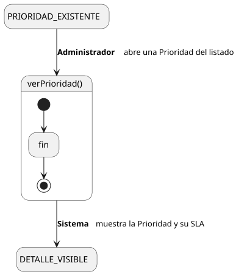
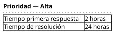

[HelpDesk](../../../README.md) / [Fase de Elaboración](../../README.md) / [Especificación de Casos de Uso](../README.md) / [Prioridad](README.md)

# UC-32 · Ver Prioridad

| Campo | Valor |
|---|---|
| Actor principal | Administrador del Sistema |
| Precondición | La `Prioridad` existe |
| Postcondición (éxito) | El Sistema muestra el nombre de la `Prioridad` y su `SLA` (tiempos de primera respuesta y resolución). No cambia ningún dato — es una consulta |
| Postcondición (fallo) | — (no aplica; es una consulta de solo lectura) |

<table>
<tr><td align="center">

</td></tr>
<tr><td align="center"><i><a href="../../../../puml/02-fase-elaboracion/especificacion-casos-uso/prioridad/UC32-ver-prioridad.puml">Código fuente</a></i></td></tr>
</table>

### Wireframe

<table>
<tr><td align="center">

</td></tr>
<tr><td align="center"><i><a href="../../../../puml/02-fase-elaboracion/especificacion-casos-uso/prioridad/UC32-ver-prioridad-wireframe.puml">Código fuente</a></i></td></tr>
</table>

### Flujo básico

1. El Administrador abre una Prioridad desde el listado ([UC-33](UC-33-listar-prioridades.md)).
2. El Sistema muestra el nombre de la `Prioridad` y su `SLA`.

### Flujos alternativos

_(ninguno — es una consulta sin ramas de validación)_

### Reglas de negocio relacionadas

- Ninguna adicional — mismo patrón de consulta simple que el resto de los catálogos de configuración.
