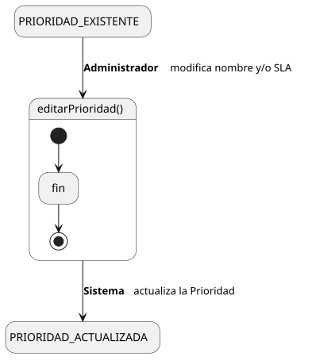
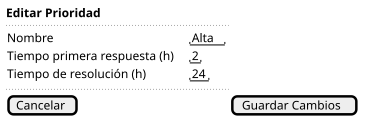

[HelpDesk](../../../README.md) / [Fase de Elaboración](../../README.md) / [Especificación de Casos de Uso](../README.md) / [Prioridad](README.md)

# UC-34 · Editar Prioridad

| Campo | Valor |
|---|---|
| Actor principal | Administrador del Sistema |
| Precondición | La `Prioridad` existe |
| Postcondición (éxito) | Se actualiza el nombre de la `Prioridad` y/o su `SLA` |
| Postcondición (fallo) | La `Prioridad` conserva sus valores anteriores; el Sistema muestra los errores de validación |

<table>
<tr><td align="center">

</td></tr>
<tr><td align="center"><i><a href="../../../../puml/02-fase-elaboracion/especificacion-casos-uso/prioridad/UC34-editar-prioridad.puml">Código fuente</a></i></td></tr>
</table>

### Wireframe

<table>
<tr><td align="center">

</td></tr>
<tr><td align="center"><i><a href="../../../../puml/02-fase-elaboracion/especificacion-casos-uso/prioridad/UC34-editar-prioridad-wireframe.puml">Código fuente</a></i></td></tr>
</table>

### Flujo básico

1. El Administrador abre una Prioridad existente ([UC-32](UC-32-ver-prioridad.md)).
2. El Administrador selecciona "Editar Prioridad".
3. El Sistema muestra el formulario precargado con los valores actuales.
4. El Administrador modifica el nombre y/o el `SLA`, y confirma.
5. El Sistema valida que el nombre no quede vacío ni duplicado, y que ambos tiempos sean valores positivos.
6. El Sistema actualiza la `Prioridad`.
7. El Sistema muestra la confirmación.

### Flujos alternativos

- **FA-1 — Validación fallida (paso 5):** el Sistema muestra el error junto al campo y vuelve al paso 4, conservando lo ya editado.

### Reglas de negocio relacionadas

- **Editar el `SLA` no recalcula tickets ya resueltos.** `Ticket.fechaResolucion` es un dato fijo de cada instancia (ver [Diagrama de Clases](../../../01-fase-inicio/modelo-dominio/diagrama-clases.md)) — el nuevo `SLA` solo aplica hacia adelante, para el cálculo de cumplimiento que hará [UC-20 Ver Dashboard de Métricas](../reportes/UC-20-ver-dashboard-metricas.md).
