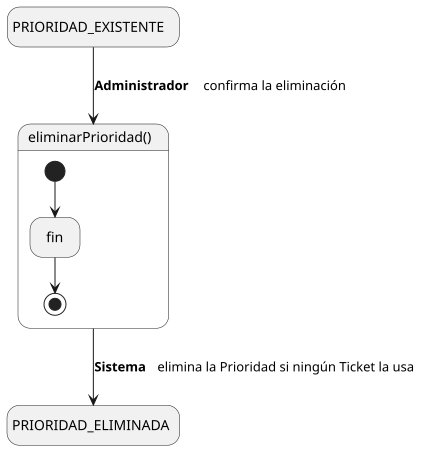
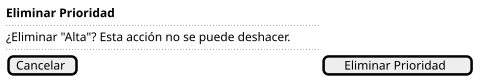

[HelpDesk](../../../README.md) / [Fase de Elaboración](../../README.md) / [Especificación de Casos de Uso](../README.md) / [Prioridad](README.md)

# UC-35 · Eliminar Prioridad

| Campo | Valor |
|---|---|
| Actor principal | Administrador del Sistema |
| Precondición | La `Prioridad` existe y ningún `Ticket` la tiene asignada |
| Postcondición (éxito) | La `Prioridad` y su `SLA` se eliminan |
| Postcondición (fallo) | La `Prioridad` sigue existiendo; el Sistema informa por qué no se pudo eliminar |

<table>
<tr><td align="center">

</td></tr>
<tr><td align="center"><i><a href="../../../../puml/02-fase-elaboracion/especificacion-casos-uso/prioridad/UC35-eliminar-prioridad.puml">Código fuente</a></i></td></tr>
</table>

### Wireframe

<table>
<tr><td align="center">

</td></tr>
<tr><td align="center"><i><a href="../../../../puml/02-fase-elaboracion/especificacion-casos-uso/prioridad/UC35-eliminar-prioridad-wireframe.puml">Código fuente</a></i></td></tr>
</table>

### Flujo básico

1. El Administrador abre una Prioridad existente ([UC-32](UC-32-ver-prioridad.md)).
2. El Administrador selecciona "Eliminar Prioridad".
3. El Sistema verifica que ningún `Ticket` tenga esta `Prioridad` asignada.
4. El Sistema pide confirmación.
5. El Administrador confirma.
6. El Sistema elimina la `Prioridad` junto con su `SLA`.
7. El Sistema muestra la confirmación.

### Flujos alternativos

- **FA-1 — La Prioridad está en uso (paso 3):** el Sistema rechaza la eliminación e informa cuántos `Ticket` la tienen asignada; no llega a pedir confirmación.

### Reglas de negocio relacionadas

- **Decisión de diseño nueva: no se puede eliminar una Prioridad referenciada por algún Ticket.** `Ticket — Prioridad` es una relación obligatoria en el [Modelo de Dominio](../../../01-fase-inicio/modelo-dominio/diagrama-clases.md) — todo `Ticket` tiene exactamente una — así que eliminarla dejaría tickets sin `Prioridad`, violando esa obligatoriedad. A diferencia de [Eliminar Equipo (UC-30)](../equipo/UC-30-eliminar-equipo.md), donde la relación equivalente es opcional y perder el Equipo es un estado válido, aquí no existe esa opción: el Administrador debe reasignar esos tickets a otra Prioridad primero (no hay un caso de uso de "reasignar prioridad en bloque" en el catálogo) o, simplemente, no puede eliminarla mientras siga en uso.
- **Al eliminar la Prioridad se elimina también su `SLA` asociado** — misma relación 1 a 1 y mismo ciclo de vida que se fijó en [UC-31](UC-31-crear-prioridad.md).
