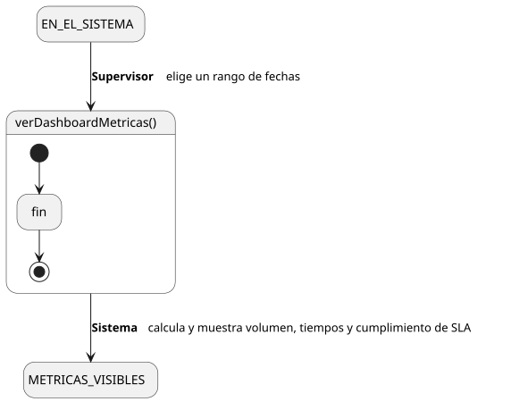
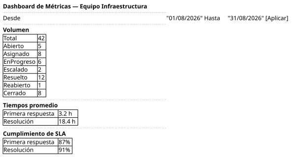

[HelpDesk](../../../README.md) / [Fase de Elaboración](../../README.md) / [Especificación de Casos de Uso](../README.md) / [Reportes](README.md)

# UC-20 · Ver Dashboard de Métricas

| Campo | Valor |
|---|---|
| Actor principal | Supervisor |
| Precondición | El actor pertenece a un `Equipo` |
| Postcondición (éxito) | El Sistema muestra KPIs de volumen, tiempos y cumplimiento de SLA de los tickets del Equipo del actor creados dentro del rango de fechas seleccionado. No cambia ningún dato — es una consulta |
| Postcondición (fallo) | — (no aplica; es una consulta de solo lectura) |

<table>
<tr><td align="center">

</td></tr>
<tr><td align="center"><i><a href="../../../../puml/02-fase-elaboracion/especificacion-casos-uso/reportes/UC20-ver-dashboard-metricas.puml">Código fuente</a></i></td></tr>
</table>

### Wireframe

<table>
<tr><td align="center">

</td></tr>
<tr><td align="center"><i><a href="../../../../puml/02-fase-elaboracion/especificacion-casos-uso/reportes/UC20-ver-dashboard-metricas-wireframe.puml">Código fuente</a></i></td></tr>
</table>

### Flujo básico

1. El Supervisor abre "Dashboard de Métricas".
2. El Sistema muestra el selector de rango de fechas (desde/hasta), con el mes actual como valor por defecto.
3. El Supervisor confirma o ajusta el rango y confirma.
4. El Sistema identifica los `Ticket` de Categorías atendidas por el `Equipo` del actor, con `fechaCreacion` dentro del rango seleccionado.
5. El Sistema calcula y muestra:
   - **Volumen**: total de tickets y su desglose por `estado`.
   - **Tiempos promedio**: tiempo de primera respuesta (fecha del primer `Comentario` de un Agente de Soporte menos `fechaCreacion`) y tiempo de resolución (`fechaResolucion` menos `fechaCreacion`), sobre los tickets `Resuelto`/`Cerrado`/`Reabierto` del período.
   - **Cumplimiento de SLA**: porcentaje de esos tickets que cumplieron `tiempoPrimeraRespuesta` y porcentaje que cumplieron `tiempoResolucion` del `SLA` de su `Prioridad` confirmada.

### Flujos alternativos

- **FA-1 — El rango no tiene tickets (paso 4):** el Sistema muestra el Dashboard vacío con un aviso, no un error.
- **FA-2 — Rango de fechas inválido, "desde" posterior a "hasta" (paso 3):** el Sistema rechaza el rango y pide corregirlo.

### Reglas de negocio relacionadas

- **El Dashboard se acota al Equipo del Supervisor**, mismo criterio que [UC-14](../tickets/UC-14-listar-cola-de-tickets.md), [UC-18](../tickets/UC-18-asignar-ticket.md) y [UC-19](../tickets/UC-19-reasignar-ticket.md) — no hay una vista global de todos los equipos en el catálogo.
- **El rango filtra por `fechaCreacion`, no por `fechaResolucion`.** Así todas las métricas del período (volumen, tiempos, cumplimiento) se calculan sobre la misma cohorte de tickets, en vez de mezclar poblaciones distintas. Un ticket creado dentro del rango pero resuelto después cuenta en el volumen, pero no aporta a tiempos ni cumplimiento hasta que tenga `fechaResolucion`.
- **`tiempoPrimeraRespuesta` se deriva del primer `Comentario` hecho por un Agente de Soporte en el ticket**, ya que el Modelo de Dominio no tiene ninguna marca explícita de "primera respuesta". Un ticket resuelto sin que el Agente haya comentado (solo tomado y resuelto directamente) no aporta dato a esta métrica específica — queda excluido del promedio y del cálculo de cumplimiento, no cuenta como incumplimiento.
- **El cumplimiento de `SLA` se calcula en vivo comparando contra el `SLA` de la `Prioridad` confirmada del ticket, no se almacena** — decisión ya fijada en el [Modelo de Dominio](../../../01-fase-inicio/modelo-dominio/diagrama-clases.md). Este caso de uso cierra **R-07** del todo (ver [Lista de Riesgos](../../../01-fase-inicio/lista-riesgos.md)).
- **Este caso de uso no genera `EventoAuditoria`** — es una consulta agregada de solo lectura, mismo criterio que el resto de los listados del catálogo.
