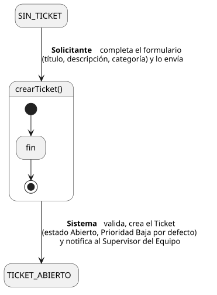
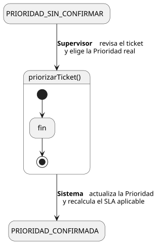

[HelpDesk](../../README.md) / [Fase de Elaboración](../README.md) / [Especificación de Casos de Uso](README.md)

# Tickets

Casos de uso del ciclo de vida del `Ticket`: UC-03 a UC-08 (Solicitante), UC-11 a UC-14 (Agente de Soporte), UC-18 y UC-19 (Supervisor). Se agrupan aquí en vez de por actor porque son el mismo flujo de negocio visto desde distintos roles — ver el [Diagrama de Estados del Ticket](../../01-fase-inicio/modelo-dominio/diagrama-estados.md) para el ciclo completo.

## UC-03 · Crear Ticket

| Campo | Valor |
|---|---|
| Actor principal | Solicitante |
| Precondición | El actor está autenticado en el sistema |
| Postcondición (éxito) | Se crea un `Ticket` con estado `Abierto` y Prioridad `Baja` (por defecto, pendiente de confirmar); se registra un `EventoAuditoria` de creación; se notifica al Supervisor del Equipo que atiende la Categoría elegida |
| Postcondición (fallo) | No se crea ningún `Ticket`; el Sistema muestra los errores de validación y conserva lo ya ingresado |

<table>
<tr><td align="center">

</td></tr>
<tr><td align="center"><i><a href="../../../puml/02-fase-elaboracion/especificacion-casos-uso/UC03-crear-ticket.puml">Código fuente</a></i></td></tr>
</table>

### Flujo básico

1. El Solicitante selecciona "Crear Ticket".
2. El Sistema muestra el formulario de creación: título, descripción, categoría.
3. El Solicitante completa el título y la descripción, y selecciona una Categoría.
4. El Solicitante envía el formulario.
5. El Sistema valida que los campos obligatorios estén completos.
6. El Sistema crea el Ticket: estado `Abierto`, Prioridad `Baja` (por defecto), `fechaCreacion` = fecha/hora actual, Solicitante = actor autenticado.
7. El Sistema registra un `EventoAuditoria` de tipo "Creación".
8. El Sistema notifica al Supervisor del Equipo que atiende la Categoría seleccionada.
9. El Sistema muestra al Solicitante la confirmación, con el ticket recién creado.

### Flujos alternativos

- **FA-1 — Validación fallida (paso 5):** si faltan campos obligatorios, el Sistema muestra los errores junto al campo correspondiente y vuelve al paso 3, conservando los datos ya ingresados.
- **FA-2 — Categoría sin Equipo asignado (paso 8):** la relación `Categoria — Equipo` es opcional en el Modelo de Dominio. Si la Categoría elegida todavía no tiene Equipo asociado, el Sistema omite la notificación; el ticket queda creado pero sin enrutar, a la espera de que un Administrador le asigne Equipo a la Categoría o de asignación manual.

### Reglas de negocio relacionadas

- Notificación al Supervisor al crearse un ticket — capturada en el [Modelo de Dominio](../../01-fase-inicio/modelo-dominio/README.md#reglas-de-negocio-capturadas-para-casos-de-uso).
- El Solicitante no elige la Prioridad — la fija el Supervisor en [UC-41 · Priorizar Ticket](#uc-41--priorizar-ticket), para no heredar el sesgo de "todo es urgente" de quien reporta. Ver también la decisión correspondiente en el [Modelo de Casos de Uso](../../01-fase-inicio/casos-de-uso.md).

## UC-41 · Priorizar Ticket

| Campo | Valor |
|---|---|
| Actor principal | Supervisor |
| Precondición | El `Ticket` existe con Prioridad `Baja` sin confirmar (recién creado) |
| Postcondición (éxito) | El `Ticket` queda con la Prioridad real definida por el Supervisor; el SLA aplicable (tiempos de primera respuesta y resolución) se recalcula según esa Prioridad |
| Postcondición (fallo) | La Prioridad no cambia |

<table>
<tr><td align="center">

</td></tr>
<tr><td align="center"><i><a href="../../../puml/02-fase-elaboracion/especificacion-casos-uso/UC41-priorizar-ticket.puml">Código fuente</a></i></td></tr>
</table>

### Flujo básico

1. El Supervisor abre un ticket de su Equipo.
2. El Sistema muestra el detalle del ticket, incluida su Prioridad actual (`Baja`, por defecto).
3. El Supervisor evalúa el impacto real y selecciona la Prioridad correspondiente (Baja, Media, Alta, Crítica).
4. El Sistema actualiza la Prioridad del Ticket y marca `prioridadConfirmada = true`.
5. El Sistema registra un `EventoAuditoria` de tipo "Priorización".
6. El Sistema recalcula el SLA aplicable (tiempos de primera respuesta y resolución) en función de la nueva Prioridad.

### Flujos alternativos

- **FA-1 — Confirma la prioridad por defecto (paso 3):** si el Supervisor considera correcta la Prioridad `Baja` inicial, la deja sin cambios; el caso de uso termina igual (queda registrado que fue revisada).

### Reglas de negocio relacionadas

- Todo `Ticket` se crea con Prioridad `Baja` por defecto — decisión tomada aquí precisamente para separar "reportar" de "priorizar": quien reporta no debería decidir la urgencia real. Documentado también en el [Modelo de Dominio](../../01-fase-inicio/modelo-dominio/README.md#reglas-de-negocio-capturadas-para-casos-de-uso).
