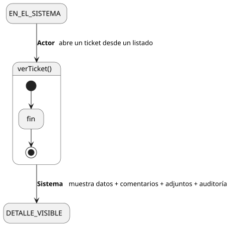

[HelpDesk](../../../README.md) / [Fase de Elaboración](../../README.md) / [Especificación de Casos de Uso](../README.md) / [Tickets](README.md)

# UC-04 · Ver Ticket

| Campo | Valor |
|---|---|
| Actor principal | Solicitante |
| Precondición | El `Ticket` existe y el actor tiene acceso a él |
| Postcondición (éxito) | El Sistema muestra el detalle del ticket, sus `Comentario`, `Adjunto` y el historial de `EventoAuditoria`. No cambia ningún dato — es una consulta |
| Postcondición (fallo) | El Sistema deniega el acceso; no se muestra nada del ticket |

<table>
<tr><td align="center">

</td></tr>
<tr><td align="center"><i><a href="../../../../puml/02-fase-elaboracion/especificacion-casos-uso/tickets/UC04-ver-ticket.puml">Código fuente</a></i></td></tr>
</table>

### Wireframe

<table>
<tr><td align="center">

</td></tr>
<tr><td align="center"><i><a href="../../../../puml/02-fase-elaboracion/especificacion-casos-uso/tickets/UC04-ver-ticket-wireframe.puml">Código fuente</a></i></td></tr>
</table>

### Flujo básico

1. El actor abre un ticket desde un listado (Tickets Propios, Cola, u otro).
2. El Sistema verifica que el actor tiene acceso a ese ticket.
3. El Sistema muestra los datos del ticket: título, descripción, categoría, prioridad, estado, agente asignado (si tiene) y fechas.
4. El Sistema muestra los `Comentario` asociados, en orden cronológico.
5. El Sistema muestra los `Adjunto` asociados.
6. El Sistema muestra el historial de `EventoAuditoria`.

### Flujos alternativos

- **FA-1 — Actor sin acceso (paso 2):** si el actor no es el Solicitante que reportó el ticket ni un Agente de Soporte/Supervisor con relación a él (asignado, o de un Equipo que atiende su Categoría), el Sistema deniega el acceso y no revela ningún dato del ticket.

### Reglas de negocio relacionadas

- **No existe distinción entre comentarios "internos" (solo agentes) y visibles al Solicitante.** Todo `Comentario` agregado a un ticket es visible para cualquiera con acceso a él, incluido el Solicitante — mismo criterio de alcance mínimo que ya se aplicó a `Comentario` en el Modelo de Casos de Uso (tampoco tiene "Eliminar Comentario"). Si en el futuro se necesitan notas internas, sería un atributo nuevo en `Comentario` (`visibilidad`, igual que ya existe en `ArticuloConocimiento`), no un caso de uso distinto.
- **El Administrador del Sistema solo puede ver los tickets que él mismo reportó como Solicitante.** No hereda de `AgenteSoporte`, así que no tiene acceso ampliado a tickets ajenos en este caso de uso — coherente con que en el Modelo de Dominio y el Modelo de Casos de Uso `Administrador` nunca se relacionó con `Ticket` más que como cualquier `Usuario`. Si se necesita visibilidad global para soporte/depuración, es una decisión a tomar explícitamente más adelante, no un efecto colateral de este caso de uso.
- El historial de auditoría que se muestra aquí es la implementación del objetivo "auditar quién hizo qué sobre un ticket" (Documento de Visión, 3.4) — ver la decisión de modelado correspondiente en [Casos de Uso](../../../01-fase-inicio/casos-de-uso.md).
