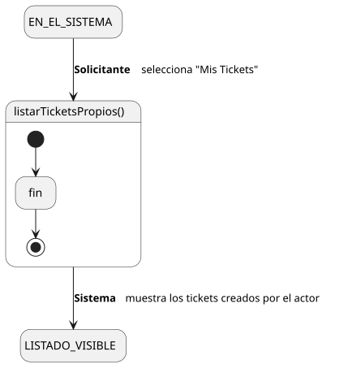
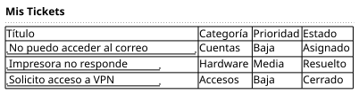

[HelpDesk](../../../README.md) / [Fase de Elaboración](../../README.md) / [Especificación de Casos de Uso](../README.md) / [Tickets](README.md)

# UC-05 · Listar Tickets Propios

| Campo | Valor |
|---|---|
| Actor principal | Solicitante |
| Precondición | El actor está autenticado en el Sistema |
| Postcondición (éxito) | El Sistema muestra los tickets creados por el actor, con título, categoría, prioridad y estado de cada uno. No cambia ningún dato — es una consulta |
| Postcondición (fallo) | — (no aplica; es una consulta de solo lectura) |

<table>
<tr><td align="center">

</td></tr>
<tr><td align="center"><i><a href="../../../../puml/02-fase-elaboracion/especificacion-casos-uso/tickets/UC05-listar-tickets-propios.puml">Código fuente</a></i></td></tr>
</table>

### Wireframe

<table>
<tr><td align="center">

</td></tr>
<tr><td align="center"><i><a href="../../../../puml/02-fase-elaboracion/especificacion-casos-uso/tickets/UC05-listar-tickets-propios-wireframe.puml">Código fuente</a></i></td></tr>
</table>

### Flujo básico

1. El Solicitante selecciona "Mis Tickets".
2. El Sistema identifica los `Ticket` creados por el actor.
3. El Sistema los muestra: título, categoría, prioridad y estado de cada uno.

### Flujos alternativos

_(ninguno — es una consulta sin ramas de validación)_

### Reglas de negocio relacionadas

- **Este listado no filtra por estado.** A diferencia de la Cola de Tickets ([UC-14](UC-14-listar-cola-de-tickets.md)), que solo tiene sentido para tickets activos, el Solicitante necesita ver también sus tickets `Cerrado` — es su propio historial, no una cola de trabajo.
- Seleccionar un ticket de la lista abre su detalle vía [UC-04 Ver Ticket](UC-04-ver-ticket.md).
