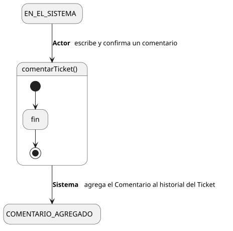
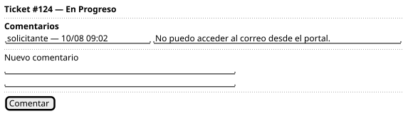

[HelpDesk](../../../README.md) / [Fase de Elaboración](../../README.md) / [Especificación de Casos de Uso](../README.md) / [Tickets](README.md)

# UC-06 · Comentar Ticket

| Campo | Valor |
|---|---|
| Actor principal | Solicitante |
| Precondición | El actor tiene acceso al `Ticket` (mismo criterio que [UC-04](UC-04-ver-ticket.md)) |
| Postcondición (éxito) | Se agrega un nuevo `Comentario` al `Ticket`, con autor = actor y fecha = ahora. No cambia el `estado` del ticket ni ningún otro dato |
| Postcondición (fallo) | No se agrega el comentario |

<table>
<tr><td align="center">

</td></tr>
<tr><td align="center"><i><a href="../../../../puml/02-fase-elaboracion/especificacion-casos-uso/tickets/UC06-comentar-ticket.puml">Código fuente</a></i></td></tr>
</table>

### Wireframe

<table>
<tr><td align="center">

</td></tr>
<tr><td align="center"><i><a href="../../../../puml/02-fase-elaboracion/especificacion-casos-uso/tickets/UC06-comentar-ticket-wireframe.puml">Código fuente</a></i></td></tr>
</table>

### Flujo básico

1. El actor abre un ticket al que tiene acceso ([UC-04](UC-04-ver-ticket.md)).
2. El actor escribe el texto del comentario.
3. El actor confirma.
4. El Sistema valida que el texto no esté vacío.
5. El Sistema crea el `Comentario`, asociado al `Ticket`, con autor = actor y fecha = ahora.
6. El Sistema lo agrega al historial de comentarios visible en UC-04.

### Flujos alternativos

- **FA-1 — Texto vacío (paso 4):** el Sistema rechaza el envío y pide contenido.

### Reglas de negocio relacionadas

- **Comentar Ticket no cambia el `estado` del `Ticket` ni ningún otro de sus datos** — es el mecanismo para aclarar o aportar información sin editar el ticket directamente, coherente con la decisión "No existe Editar Ticket" (ver [Casos de Uso](../../../01-fase-inicio/casos-de-uso.md)).
- **Cualquier actor con acceso al ticket puede comentar** — Solicitante, y por herencia Agente de Soporte/Supervisor/Administrador (si son quienes lo reportaron). No hay distinción de comentario "interno" (ver decisión en [UC-04](UC-04-ver-ticket.md)).
- **Comentar no genera notificación propia**, a diferencia de crear/resolver/escalar/cerrar/reabrir. Es una decisión deliberada de alcance mínimo, no un gap: a diferencia de esos eventos, un comentario no tiene una consecuencia con plazo (nada se vence ni se pierde si no se lee de inmediato) — el actor se entera la próxima vez que abre el ticket. Se puede reconsiderar si en el futuro se agrega un sistema de notificaciones configurable.
