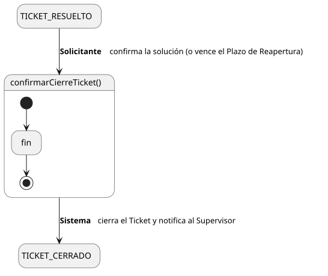
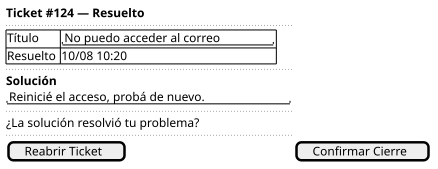

[HelpDesk](../../../README.md) / [Fase de Elaboración](../../README.md) / [Especificación de Casos de Uso](../README.md) / [Tickets](README.md)

# UC-07 · Confirmar Cierre de Ticket

| Campo | Valor |
|---|---|
| Actor principal | Solicitante |
| Precondición | El `Ticket` está en estado `Resuelto` y el actor es quien lo reportó |
| Postcondición (éxito) | El `Ticket` pasa a `Cerrado`; se registra un `EventoAuditoria`; se notifica al Supervisor del Equipo |
| Postcondición (fallo) | El `Ticket` sigue en `Resuelto` |

<table>
<tr><td align="center">

</td></tr>
<tr><td align="center"><i><a href="../../../../puml/02-fase-elaboracion/especificacion-casos-uso/tickets/UC07-confirmar-cierre-ticket.puml">Código fuente</a></i></td></tr>
</table>

### Wireframe

<table>
<tr><td align="center">

</td></tr>
<tr><td align="center"><i><a href="../../../../puml/02-fase-elaboracion/especificacion-casos-uso/tickets/UC07-confirmar-cierre-ticket-wireframe.puml">Código fuente</a></i></td></tr>
</table>

### Flujo básico

1. El Solicitante abre un ticket en estado `Resuelto` ([UC-04](UC-04-ver-ticket.md)).
2. El Solicitante selecciona "Confirmar Cierre".
3. El Sistema pide confirmación.
4. El Solicitante confirma.
5. El Sistema cambia el `estado` del `Ticket` a `Cerrado`.
6. El Sistema registra un `EventoAuditoria` de tipo "Cierre", con autor = el Solicitante.
7. El Sistema notifica al Supervisor del Equipo.

### Flujos alternativos

- **FA-1 — Vence el Plazo de Reapertura sin que el Solicitante actúe:** el propio Sistema ejecuta el mismo resultado (`Ticket` → `Cerrado`) sin pasar por los pasos 2 a 4, disparado por el vencimiento de `Ticket.fechaLimiteReapertura` (ver [Diagrama de Estados](../../../01-fase-inicio/modelo-dominio/diagrama-estados.md) y [Glosario](../../../01-fase-inicio/glosario.md)). El `EventoAuditoria` que se registra es del mismo tipo "Cierre", pero con autor = ninguno (ver regla de negocio abajo), y la notificación al Supervisor se dispara igual.

### Reglas de negocio relacionadas

- **`EventoAuditoria.autor` es opcional — puede quedar sin `Usuario` cuando el evento lo dispara el Sistema, no un actor.** Hasta este caso de uso, todo `EventoAuditoria` tenía un actor humano detrás (crear, tomar, resolver, escalar). El cierre automático por Plazo de Reapertura es el primer evento que no lo tiene, y el historial de [UC-04](UC-04-ver-ticket.md) necesita poder distinguir "cerró el Solicitante" de "se cerró solo" sin inventar un `Usuario` ficticio "Sistema" — sería una entidad de dominio falsa solo para rellenar un campo. Actualizado en el [Diagrama de Clases](../../../01-fase-inicio/modelo-dominio/diagrama-clases.md).
- **No se agrega una notificación adicional al Solicitante en el cierre automático.** Ya recibió la notificación de resolución al entrar en `Resuelto` ([UC-12](UC-12-resolver-ticket.md)); notificarlo de nuevo por no haber actuado sería ruido, no información nueva.
- La regla de notificación al cerrar (a Supervisor) ya estaba capturada en el Modelo de Dominio desde la Fase de Inicio — este caso de uso no agrega una regla nueva, solo confirma que aplica también al camino automático.
