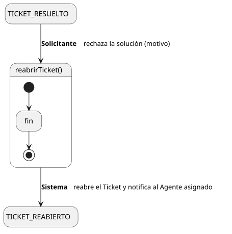
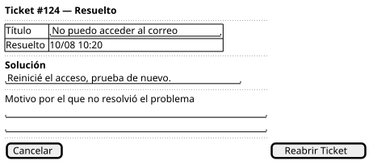

[HelpDesk](../../../README.md) / [Fase de Elaboración](../../README.md) / [Especificación de Casos de Uso](../README.md) / [Tickets](README.md)

# UC-08 · Reabrir Ticket

| Campo | Valor |
|---|---|
| Actor principal | Solicitante |
| Precondición | El `Ticket` está en estado `Resuelto` y el actor es quien lo reportó |
| Postcondición (éxito) | El `Ticket` pasa a `Reabierto`, conservando el mismo `AgenteSoporte` asignado; se registra un `EventoAuditoria` con el motivo; se notifica al Agente asignado |
| Postcondición (fallo) | El `Ticket` sigue en `Resuelto` |

<table>
<tr><td align="center">

</td></tr>
<tr><td align="center"><i><a href="../../../../puml/02-fase-elaboracion/especificacion-casos-uso/tickets/UC08-reabrir-ticket.puml">Código fuente</a></i></td></tr>
</table>

### Wireframe

<table>
<tr><td align="center">

</td></tr>
<tr><td align="center"><i><a href="../../../../puml/02-fase-elaboracion/especificacion-casos-uso/tickets/UC08-reabrir-ticket-wireframe.puml">Código fuente</a></i></td></tr>
</table>

### Flujo básico

1. El Solicitante abre un ticket en estado `Resuelto` ([UC-04](UC-04-ver-ticket.md)) y determina que la solución no resolvió su problema.
2. El Solicitante selecciona "Reabrir Ticket".
3. El Sistema pide un motivo.
4. El Solicitante lo completa y confirma.
5. El Sistema cambia el `estado` del `Ticket` a `Reabierto`, sin tocar su `AgenteSoporte` asignado.
6. El Sistema registra un `EventoAuditoria` de tipo "Reapertura", con el motivo.
7. El Sistema notifica al `AgenteSoporte` asignado.

### Flujos alternativos

_(ninguno adicional — el motivo es obligatorio, mismo criterio que [UC-13](UC-13-escalar-ticket.md))_

### Reglas de negocio relacionadas

- **Gap detectado al detallar este caso de uso: no estaba capturada la notificación al reabrir un ticket.** Sin ella, el Agente que lo resolvió no se enteraría de que su solución no funcionó. Agregada al [Modelo de Dominio](../../../01-fase-inicio/modelo-dominio/README.md#reglas-de-negocio-capturadas-para-casos-de-uso).
- **El ticket reabierto conserva el mismo `AgenteSoporte` que lo resolvió — no vuelve a la cola de tickets sin asignar.** A diferencia de `Escalar Ticket` (que sí libera la asignación porque cambia de nivel de resolución), reabrir es continuar con el mismo trabajo que ya estaba en curso; forzar que otro agente lo retome desde cero perdería el contexto que el agente original ya tiene.
- **La transición `Reabierto → EnProgreso` del [Diagrama de Estados](../../../01-fase-inicio/modelo-dominio/diagrama-estados.md) no tiene caso de uso propio.** Es el mismo tipo de transición de bajo significado que `Asignado → EnProgreso` (ver decisión correspondiente en ese documento): el Agente simplemente retoma un ticket que ya es suyo, sin una regla de negocio nueva que capturar.
