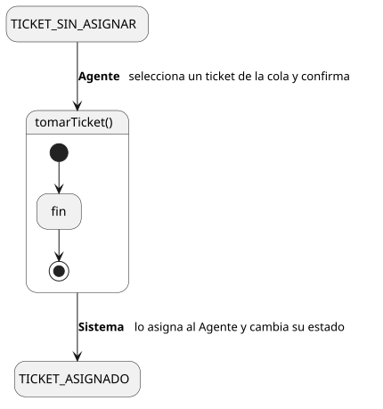
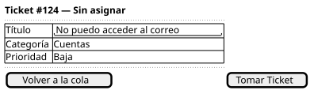

[HelpDesk](../../../README.md) / [Fase de Elaboración](../../README.md) / [Especificación de Casos de Uso](../README.md) / [Tickets](README.md)

# UC-11 · Tomar Ticket

| Campo | Valor |
|---|---|
| Actor principal | Agente de Soporte |
| Precondición | Existe un `Ticket` sin agente asignado (estado `Abierto` o `Escalado`) en una Categoría atendida por el Equipo del actor |
| Postcondición (éxito) | El `Ticket` queda con `AgenteSoporte` = el actor; su estado pasa a `Asignado` (si venía de `Abierto`) o a `EnProgreso` (si venía de `Escalado`); se registra un `EventoAuditoria` |
| Postcondición (fallo) | El `Ticket` sigue sin asignar |

<table>
<tr><td align="center">

</td></tr>
<tr><td align="center"><i><a href="../../../../puml/02-fase-elaboracion/especificacion-casos-uso/tickets/UC11-tomar-ticket.puml">Código fuente</a></i></td></tr>
</table>

### Wireframe

<table>
<tr><td align="center">

</td></tr>
<tr><td align="center"><i><a href="../../../../puml/02-fase-elaboracion/especificacion-casos-uso/tickets/UC11-tomar-ticket-wireframe.puml">Código fuente</a></i></td></tr>
</table>

### Flujo básico

1. El Agente abre la Cola de Tickets de su Equipo ([UC-14](UC-14-listar-cola-de-tickets.md)).
2. El Sistema muestra los tickets sin asignar del Equipo.
3. El Agente selecciona un ticket sin asignar.
4. El Agente confirma "Tomar Ticket".
5. El Sistema verifica que el ticket siga sin asignar.
6. El Sistema asigna el `Ticket` al Agente y avanza su `estado` según el [Diagrama de Estados](../../../01-fase-inicio/modelo-dominio/diagrama-estados.md) (`Abierto → Asignado` o `Escalado → EnProgreso`).
7. El Sistema registra un `EventoAuditoria` de tipo "Asignación".
8. El Sistema muestra el ticket con su nuevo estado.

### Flujos alternativos

- **FA-1 — Ticket ya tomado por otro agente (paso 5):** condición de carrera — dos agentes intentan tomar el mismo ticket casi al mismo tiempo. El Sistema informa que ya no está disponible y vuelve al paso 2 con la cola actualizada.

### Reglas de negocio relacionadas

- **Este caso de uso cubre tanto tomar un ticket `Abierto` como "retomar" uno `Escalado`.** El Diagrama de Estados llama a esa segunda transición "Agente de nivel superior retoma", pero es el mismo objetivo de negocio (asignarse un ticket disponible) — no se creó un caso de uso aparte para retomar, sería duplicar `Tomar Ticket` con una precondición distinta pero el mismo flujo.
- **No filtramos la cola por `nivel` del agente respecto a un ticket `Escalado`.** No existe un dato que indique "a qué nivel se escaló" — la relación `Ticket — AgenteSoporte` no distingue niveles, y agregar uno sería estructura nueva sin caso de uso que la use todavía. Por ahora, cualquier agente del Equipo puede ver y tomar un ticket `Escalado`, confiando en su propio criterio para no tomar algo que excede su nivel — mismo modelo de confianza que ya aplica a tomar tickets `Abierto`.
