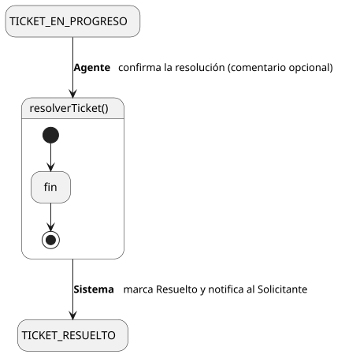
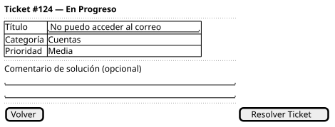

[HelpDesk](../../../README.md) / [Fase de Elaboración](../../README.md) / [Especificación de Casos de Uso](../README.md) / [Tickets](README.md)

# UC-12 · Resolver Ticket

| Campo | Valor |
|---|---|
| Actor principal | Agente de Soporte |
| Precondición | El `Ticket` está asignado al actor (estado `Asignado` o `EnProgreso`) |
| Postcondición (éxito) | El `Ticket` pasa a `Resuelto`; `fechaResolucion` = ahora; `fechaLimiteReapertura` = `fechaResolucion` + el Plazo de Reapertura; se registra un `EventoAuditoria`; se notifica al Solicitante |
| Postcondición (fallo) | El estado del `Ticket` no cambia |

<table>
<tr><td align="center">

</td></tr>
<tr><td align="center"><i><a href="../../../../puml/02-fase-elaboracion/especificacion-casos-uso/tickets/UC12-resolver-ticket.puml">Código fuente</a></i></td></tr>
</table>

### Wireframe

<table>
<tr><td align="center">

</td></tr>
<tr><td align="center"><i><a href="../../../../puml/02-fase-elaboracion/especificacion-casos-uso/tickets/UC12-resolver-ticket-wireframe.puml">Código fuente</a></i></td></tr>
</table>

### Flujo básico

1. El Agente abre un ticket que tiene asignado.
2. El Sistema muestra el detalle del ticket.
3. El Agente selecciona "Resolver Ticket".
4. El Sistema muestra la confirmación, con un campo opcional de comentario de solución.
5. El Agente confirma.
6. El Sistema cambia el `estado` del `Ticket` a `Resuelto`, fija `fechaResolucion` = fecha/hora actual y calcula `fechaLimiteReapertura`.
7. El Sistema registra un `EventoAuditoria` de tipo "Resolución".
8. El Sistema notifica al Solicitante que su ticket fue resuelto.

### Flujos alternativos

- **FA-1 — Agente agrega comentario de solución (paso 4):** si el Agente escribe un comentario antes de confirmar, el Sistema lo registra como `Comentario` (mismo mecanismo que [UC-06 Comentar Ticket](../../../01-fase-inicio/casos-de-uso.md)) asociado al ticket, antes de cambiar el estado.

### Reglas de negocio relacionadas

- **Gap detectado al detallar este caso de uso: no estaba capturada la notificación al Solicitante cuando su ticket se resuelve.** Las reglas de notificación que ya teníamos (crear → Supervisor, cerrar → Supervisor, asignar → Agente) no cubrían este evento, y sin él el Solicitante no tendría forma de enterarse de que puede [confirmar el cierre](../../../01-fase-inicio/casos-de-uso.md) o [reabrir](../../../01-fase-inicio/casos-de-uso.md) su ticket. Agregada al [Modelo de Dominio](../../../01-fase-inicio/modelo-dominio/README.md#reglas-de-negocio-capturadas-para-casos-de-uso).
- Este es el paso que activa el **Plazo de Reapertura** (ver [Glosario](../../../01-fase-inicio/glosario.md)) — desde aquí es que puede dispararse más adelante el cierre automático del [Diagrama de Estados](../../../01-fase-inicio/modelo-dominio/diagrama-estados.md).
