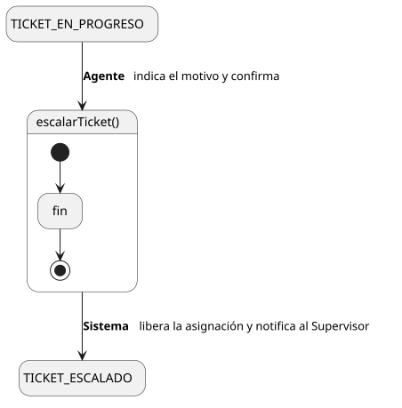
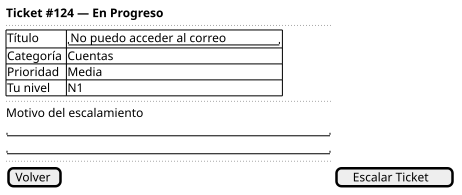

[HelpDesk](../../../README.md) / [Fase de Elaboración](../../README.md) / [Especificación de Casos de Uso](../README.md) / [Tickets](README.md)

# UC-13 · Escalar Ticket

| Campo | Valor |
|---|---|
| Actor principal | Agente de Soporte |
| Precondición | El `Ticket` está asignado al actor (estado `Asignado` o `EnProgreso`) |
| Postcondición (éxito) | El `Ticket` pasa a `Escalado`; queda sin `AgenteSoporte` asignado (disponible para que otro agente lo retome vía [UC-11](UC-11-tomar-ticket.md)); se registra un `EventoAuditoria` con el motivo; se notifica al Supervisor del Equipo |
| Postcondición (fallo) | El `Ticket` sigue asignado al actor, sin cambiar de estado |

<table>
<tr><td align="center">

</td></tr>
<tr><td align="center"><i><a href="../../../../puml/02-fase-elaboracion/especificacion-casos-uso/tickets/UC13-escalar-ticket.puml">Código fuente</a></i></td></tr>
</table>

### Wireframe

<table>
<tr><td align="center">

</td></tr>
<tr><td align="center"><i><a href="../../../../puml/02-fase-elaboracion/especificacion-casos-uso/tickets/UC13-escalar-ticket-wireframe.puml">Código fuente</a></i></td></tr>
</table>

### Flujo básico

1. El Agente, trabajando el ticket, determina que excede lo que puede resolver en su `nivel`.
2. El Agente selecciona "Escalar Ticket".
3. El Sistema pide un motivo del escalamiento.
4. El Agente lo completa y confirma.
5. El Sistema cambia el `estado` del `Ticket` a `Escalado` y libera su `AgenteSoporte` (queda sin asignar).
6. El Sistema registra un `EventoAuditoria` de tipo "Escalamiento", con el motivo.
7. El Sistema notifica al Supervisor del Equipo.

### Flujos alternativos

_(ninguno adicional — el motivo es obligatorio, no hay camino alterno de validación distinto al de cualquier campo requerido)_

### Reglas de negocio relacionadas

- **Escalar libera la asignación, no la transfiere a un agente específico.** Es exactamente el mismo modelo de "cola, no asignación directa" que ya usa la creación de tickets — un ticket escalado vuelve a ser tomado por quien pueda, vía UC-11, no se le fuerza a un agente N2/N3 en particular. Esto es lo que permite que `AgenteSoporte — Ticket` sea opcional (`0..1`) en el Modelo de Dominio.
- **Gap detectado: la notificación al escalar no estaba capturada.** Las reglas existentes cubrían crear, cerrar y asignar, pero no escalar — y un ticket escalado es justo el tipo de caso que el Supervisor necesita ver para vigilar el cumplimiento de SLA. Agregada al [Modelo de Dominio](../../../01-fase-inicio/modelo-dominio/README.md#reglas-de-negocio-capturadas-para-casos-de-uso).
- **No hay un campo que indique "a qué nivel se escaló".** El motivo queda en el `EventoAuditoria` como texto libre, no estructurado. Ver la decisión relacionada en [UC-11](UC-11-tomar-ticket.md) sobre por qué no se filtra la cola por nivel.
