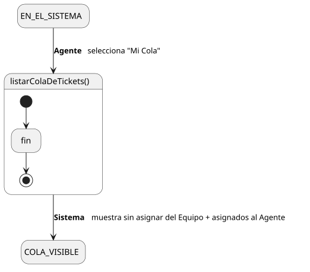
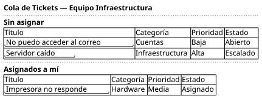

[HelpDesk](../../../README.md) / [Fase de Elaboración](../../README.md) / [Especificación de Casos de Uso](../README.md) / [Tickets](README.md)

# UC-14 · Listar Cola de Tickets

| Campo | Valor |
|---|---|
| Actor principal | Agente de Soporte |
| Precondición | El actor pertenece a un `Equipo` |
| Postcondición (éxito) | El Sistema muestra los tickets sin asignar del Equipo y los asignados al actor. No cambia ningún dato — es una consulta |
| Postcondición (fallo) | — (no aplica; es una consulta de solo lectura) |

<table>
<tr><td align="center">

</td></tr>
<tr><td align="center"><i><a href="../../../../puml/02-fase-elaboracion/especificacion-casos-uso/tickets/UC14-listar-cola-de-tickets.puml">Código fuente</a></i></td></tr>
</table>

### Wireframe

<table>
<tr><td align="center">

</td></tr>
<tr><td align="center"><i><a href="../../../../puml/02-fase-elaboracion/especificacion-casos-uso/tickets/UC14-listar-cola-de-tickets-wireframe.puml">Código fuente</a></i></td></tr>
</table>

### Flujo básico

1. El Agente selecciona "Mi Cola".
2. El Sistema identifica el `Equipo` del Agente.
3. El Sistema busca los `Ticket` sin `AgenteSoporte` asignado (estado `Abierto` o `Escalado`) cuya `Categoria` es atendida por ese `Equipo`.
4. El Sistema busca los `Ticket` con `AgenteSoporte` = el Agente actual, en cualquier estado no terminal.
5. El Sistema muestra ambos grupos por separado: título, categoría, prioridad y estado de cada ticket.

### Flujos alternativos

_(ninguno — es una consulta sin ramas de validación)_

### Reglas de negocio relacionadas

- **Un ticket cuya Categoría no tiene Equipo asignado no aparece en ninguna cola.** Mismo caso ya identificado en [UC-03, FA-2](UC-03-crear-ticket.md#flujos-alternativos): la relación `Categoria — Equipo` es opcional en el Modelo de Dominio, así que un ticket puede quedar creado pero sin ruta a ninguna cola hasta que un Administrador le asigne Equipo a su Categoría.
- El filtro de la cola es por `Equipo`, no por `nivel` del agente — un agente ve todos los tickets sin asignar de su Equipo, incluidos los `Escalado`, sin importar su propio nivel (ver decisión en [UC-11](UC-11-tomar-ticket.md)).
