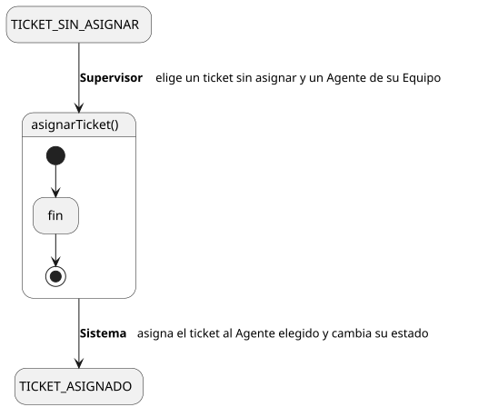
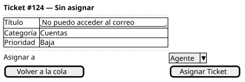

[HelpDesk](../../../README.md) / [Fase de Elaboración](../../README.md) / [Especificación de Casos de Uso](../README.md) / [Tickets](README.md)

# UC-18 · Asignar Ticket

| Campo | Valor |
|---|---|
| Actor principal | Supervisor |
| Precondición | Existe un `Ticket` sin `AgenteSoporte` asignado (estado `Abierto` o `Escalado`) en una Categoría atendida por el Equipo del actor, y el Equipo tiene al menos un Agente de Soporte |
| Postcondición (éxito) | El `Ticket` queda con `AgenteSoporte` = el Agente elegido por el Supervisor; su estado pasa a `Asignado` (si venía de `Abierto`) o a `EnProgreso` (si venía de `Escalado`); se registra un `EventoAuditoria`; se notifica al Agente asignado |
| Postcondición (fallo) | El `Ticket` sigue sin asignar |

<table>
<tr><td align="center">

</td></tr>
<tr><td align="center"><i><a href="../../../../puml/02-fase-elaboracion/especificacion-casos-uso/tickets/UC18-asignar-ticket.puml">Código fuente</a></i></td></tr>
</table>

### Wireframe

<table>
<tr><td align="center">

</td></tr>
<tr><td align="center"><i><a href="../../../../puml/02-fase-elaboracion/especificacion-casos-uso/tickets/UC18-asignar-ticket-wireframe.puml">Código fuente</a></i></td></tr>
</table>

### Flujo básico

1. El Supervisor abre la Cola de Tickets de su Equipo ([UC-14](UC-14-listar-cola-de-tickets.md)) y localiza un ticket sin asignar.
2. El Supervisor selecciona "Asignar Ticket".
3. El Sistema muestra los Agentes de Soporte del Equipo.
4. El Supervisor elige un Agente y confirma.
5. El Sistema verifica que el ticket siga sin asignar.
6. El Sistema asigna el `Ticket` al Agente elegido y avanza su `estado` según el [Diagrama de Estados](../../../01-fase-inicio/modelo-dominio/diagrama-estados.md) (`Abierto → Asignado` o `Escalado → EnProgreso`).
7. El Sistema registra un `EventoAuditoria` de tipo "Asignación".
8. El Sistema notifica al Agente asignado.
9. El Sistema muestra el ticket con su nuevo Agente y estado.

### Flujos alternativos

- **FA-1 — Ticket ya asignado por otra vía (paso 5):** condición de carrera — el propio Agente lo tomó ([UC-11](UC-11-tomar-ticket.md)) o otro Supervisor lo asignó casi al mismo tiempo. El Sistema informa que ya no está disponible y vuelve al paso 1 con la cola actualizada.

### Reglas de negocio relacionadas

- **Se reutiliza el mismo tipo de `EventoAuditoria` "Asignación" que [UC-11 Tomar Ticket](UC-11-tomar-ticket.md).** El resultado sobre el `Ticket` es idéntico (pasa de sin agente a con agente); lo único que cambia es quién dispara la transición — el Supervisor eligiendo, en vez del propio Agente autoseleccionándose. El Modelo de Dominio no necesita distinguir "cómo" se asignó, solo "que" se asignó.
- **Un ticket puede asignarse antes de que el Supervisor lo haya priorizado.** Regla ya capturada en el [Modelo de Dominio](../../../01-fase-inicio/modelo-dominio/README.md#reglas-de-negocio-capturadas-para-casos-de-uso): mientras tanto opera con Prioridad `Baja` por defecto, no es una precondición bloqueante entre casos de uso.
- El Supervisor solo puede asignar tickets de Categorías atendidas por su propio Equipo, y solo a Agentes de ese Equipo — mismo alcance que la Cola de Tickets ([UC-14](UC-14-listar-cola-de-tickets.md)).
