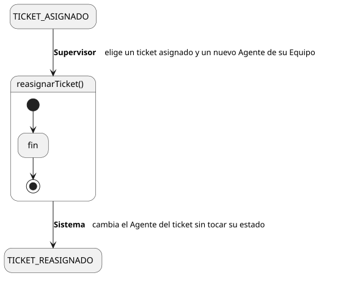
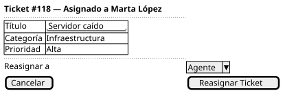

[HelpDesk](../../../README.md) / [Fase de Elaboración](../../README.md) / [Especificación de Casos de Uso](../README.md) / [Tickets](README.md)

# UC-19 · Reasignar Ticket

| Campo | Valor |
|---|---|
| Actor principal | Supervisor |
| Precondición | Existe un `Ticket` con `AgenteSoporte` ya asignado (estado `Asignado`, `EnProgreso` o `Reabierto`) en una Categoría atendida por el Equipo del actor |
| Postcondición (éxito) | El `Ticket` cambia su `AgenteSoporte` al nuevo Agente elegido por el Supervisor, sin cambiar de `estado`; se registra un `EventoAuditoria`; se notifica al nuevo Agente asignado |
| Postcondición (fallo) | El `Ticket` sigue con el `AgenteSoporte` anterior |

<table>
<tr><td align="center">

</td></tr>
<tr><td align="center"><i><a href="../../../../puml/02-fase-elaboracion/especificacion-casos-uso/tickets/UC19-reasignar-ticket.puml">Código fuente</a></i></td></tr>
</table>

### Wireframe

<table>
<tr><td align="center">

</td></tr>
<tr><td align="center"><i><a href="../../../../puml/02-fase-elaboracion/especificacion-casos-uso/tickets/UC19-reasignar-ticket-wireframe.puml">Código fuente</a></i></td></tr>
</table>

### Flujo básico

1. El Supervisor abre el detalle de un ticket ya asignado ([UC-04](UC-04-ver-ticket.md)).
2. El Supervisor selecciona "Reasignar Ticket".
3. El Sistema muestra los Agentes de Soporte del Equipo, excluyendo al agente actual.
4. El Supervisor elige un nuevo Agente y confirma.
5. El Sistema verifica que el ticket siga asignado al agente original.
6. El Sistema cambia el `AgenteSoporte` del `Ticket` al Agente elegido, sin modificar su `estado`.
7. El Sistema registra un `EventoAuditoria` de tipo "Reasignación".
8. El Sistema notifica al nuevo Agente asignado.
9. El Sistema muestra el ticket con su nuevo Agente.

### Flujos alternativos

- **FA-1 — El ticket cambió de estado o de agente antes de confirmar (paso 5):** condición de carrera — por ejemplo, el agente original ya lo resolvió o lo escaló mientras el Supervisor decidía. El Sistema informa que la reasignación ya no aplica y vuelve al detalle del ticket actualizado.

### Reglas de negocio relacionadas

- **Se introduce el tipo de `EventoAuditoria` "Reasignación", distinto de "Asignación"** ([UC-11](UC-11-tomar-ticket.md), [UC-18](UC-18-asignar-ticket.md)). A diferencia de asignar, reasignar no cambia el `estado` del `Ticket`, solo su `AgenteSoporte` — mezclar ambos bajo el mismo tipo perdería esa distinción en el historial de auditoría que el Supervisor necesita para vigilar la carga de trabajo del Equipo. Esta decisión cierra la pregunta que el [Plan de Desarrollo de Software](../../../01-fase-inicio/plan-desarrollo-software.md#tercera-iteración-de-elaboración) dejó abierta al definir esta iteración.
- **Solo se notifica al nuevo Agente asignado, no al que pierde el ticket.** La regla existente en el [Modelo de Dominio](../../../01-fase-inicio/modelo-dominio/README.md#reglas-de-negocio-capturadas-para-casos-de-uso) solo cubre "al asignarse un ticket a un Agente, se le notifica a ese Agente" — desde la perspectiva del nuevo agente, reasignar es el mismo evento que asignar.
- **No se puede reasignar un ticket `Escalado`, `Resuelto` ni `Cerrado`.** Un ticket `Escalado` ya está sin agente (se usa [Asignar Ticket](UC-18-asignar-ticket.md), no Reasignar); uno `Resuelto` o `Cerrado` ya no tiene trabajo pendiente que transferir.
