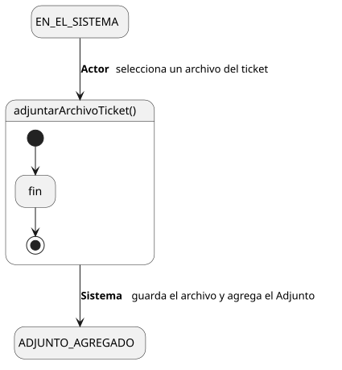
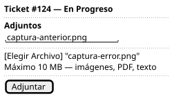

[HelpDesk](../../../README.md) / [Fase de Elaboración](../../README.md) / [Especificación de Casos de Uso](../README.md) / [Tickets](README.md)

# UC-42 · Adjuntar Archivo a Ticket

| Campo | Valor |
|---|---|
| Actor principal | Solicitante |
| Precondición | El actor tiene acceso al `Ticket` (mismo criterio que [UC-04](UC-04-ver-ticket.md)) |
| Postcondición (éxito) | Se crea un `Adjunto` asociado al `Ticket`, con `nombreArchivo`, autor = actor y fecha = ahora; el archivo queda guardado en el volumen de la instancia |
| Postcondición (fallo) | No se guarda el archivo ni se crea el `Adjunto` |

<table>
<tr><td align="center">

</td></tr>
<tr><td align="center"><i><a href="../../../../puml/02-fase-elaboracion/especificacion-casos-uso/tickets/UC42-adjuntar-archivo-ticket.puml">Código fuente</a></i></td></tr>
</table>

### Wireframe

<table>
<tr><td align="center">

</td></tr>
<tr><td align="center"><i><a href="../../../../puml/02-fase-elaboracion/especificacion-casos-uso/tickets/UC42-adjuntar-archivo-ticket-wireframe.puml">Código fuente</a></i></td></tr>
</table>

### Flujo básico

1. El actor abre un ticket al que tiene acceso ([UC-04](UC-04-ver-ticket.md)).
2. El actor selecciona "Adjuntar Archivo" y elige un archivo de su equipo.
3. El Sistema valida su tamaño y tipo contra los límites configurados de la instancia.
4. El Sistema guarda el archivo en el volumen de almacenamiento y crea el `Adjunto`, asociado al `Ticket`, con autor = actor y fecha = ahora.
5. El Sistema lo agrega a la lista de adjuntos visible en UC-04.

### Flujos alternativos

- **FA-1 — Archivo demasiado grande (paso 3):** el Sistema rechaza el archivo y muestra el límite de tamaño configurado.
- **FA-2 — Tipo de archivo no permitido (paso 3):** el Sistema rechaza el archivo. La validación es por lista blanca de tipos (ej. imágenes, PDF, texto plano), no por lista negra — evita que el adjunto se use como vector para subir contenido ejecutable u otro tipo no anticipado.

### Reglas de negocio relacionadas

- **Gap detectado al detallar este caso de uso: `Adjunto` no tenía `fecha` ni un `autor` en el Modelo de Dominio.** A diferencia de `Comentario`, que ya tenía ambos, `Adjunto` solo registraba el nombre del archivo — sin saber quién ni cuándo lo subió, UC-04 no podría mostrarlo con el mismo nivel de detalle que un comentario. Agregados al [Diagrama de Clases](../../../01-fase-inicio/modelo-dominio/diagrama-clases.md).
- **Decisión de arquitectura nueva: dónde se almacenan físicamente los archivos.** Ninguna de las decisiones previas cubría esto — se resolvió con un volumen de Docker local en vez de almacenamiento de objetos externo (S3 o compatible), para no introducir una dependencia de un servicio de terceros en un producto self-hosted. Ver [Decisión de Arquitectura](../../arquitectura.md).
- **El tamaño máximo y los tipos permitidos son configuración de la instancia, no un valor fijo del producto** — mismo criterio que el Plazo de Reapertura: la Organización adoptante decide los números exactos.
- **No hay "Eliminar Adjunto" en el catálogo**, mismo criterio de alcance mínimo que ya se aplicó a `Comentario` (tampoco tiene "Eliminar Comentario"): lo que se adjunta como evidencia queda parte del historial del ticket.
