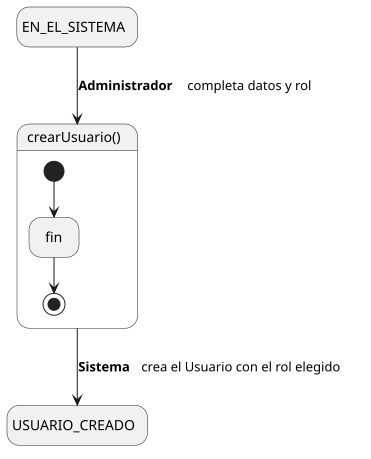
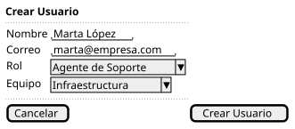

[HelpDesk](../../../README.md) / [Fase de Elaboración](../../README.md) / [Especificación de Casos de Uso](../README.md) / [Usuario](README.md)

# UC-36 · Crear Usuario

| Campo | Valor |
|---|---|
| Actor principal | Administrador del Sistema |
| Precondición | El actor está autenticado con rol Administrador |
| Postcondición (éxito) | Se crea un `Usuario` con nombre, correo y el rol indicado (Solicitante, Agente de Soporte, Supervisor o Administrador); si el rol es Agente de Soporte o Supervisor, queda con el `Equipo` indicado (opcional) |
| Postcondición (fallo) | No se crea ningún `Usuario`; el Sistema muestra los errores de validación |

<table>
<tr><td align="center">

</td></tr>
<tr><td align="center"><i><a href="../../../../puml/02-fase-elaboracion/especificacion-casos-uso/usuario/UC36-crear-usuario.puml">Código fuente</a></i></td></tr>
</table>

### Wireframe

<table>
<tr><td align="center">

</td></tr>
<tr><td align="center"><i><a href="../../../../puml/02-fase-elaboracion/especificacion-casos-uso/usuario/UC36-crear-usuario-wireframe.puml">Código fuente</a></i></td></tr>
</table>

### Flujo básico

1. El Administrador selecciona "Crear Usuario".
2. El Sistema muestra el formulario: nombre, correo, rol (Solicitante / Agente de Soporte / Supervisor / Administrador).
3. El Administrador completa nombre y correo, y selecciona el rol.
4. Si el rol es Agente de Soporte o Supervisor, el Sistema muestra el selector de Equipo (opcional).
5. El Administrador completa el Equipo, si aplica, y envía el formulario.
6. El Sistema valida que el nombre y el correo no estén vacíos, y que el correo no esté ya registrado.
7. El Sistema crea el `Usuario` con el rol elegido.
8. El Sistema muestra la confirmación.

### Flujos alternativos

- **FA-1 — Validación fallida o correo duplicado (paso 6):** el Sistema muestra el error correspondiente junto al campo y vuelve al paso 3, conservando lo ya ingresado.

### Reglas de negocio relacionadas

- **El rol se modela en el [Diagrama de Clases](../../../01-fase-inicio/modelo-dominio/diagrama-clases.md) como jerarquía de clases** (`Usuario ← AgenteSoporte ← Supervisor`, `Usuario ← Administrador`), no como un atributo. Cómo una única operación de alta instancia la subclase correcta es una decisión de implementación, no de dominio — queda anotada como pendiente para el [Modelo de Análisis/Diseño](../../../01-fase-inicio/modelo-dominio/README.md#pendiente-para-elaboración), no se resuelve en este caso de uso.
- **Este caso de uso no genera `EventoAuditoria`**, mismo criterio ya fijado en [UC-21 Crear Categoría](../categoria/UC-21-crear-categoria.md) para las entidades de configuración.
- Un Solicitante puro no tiene `Equipo` — ese campo solo aplica a Agente de Soporte y Supervisor, coherente con la relación opcional `AgenteSoporte — Equipo` del Modelo de Dominio.
