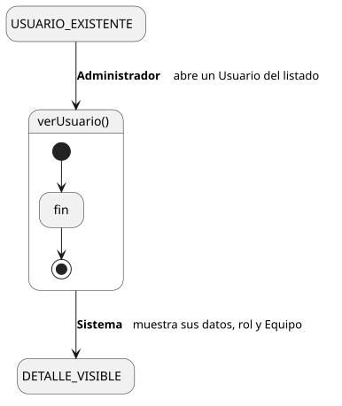
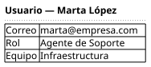

[HelpDesk](../../../README.md) / [Fase de Elaboración](../../README.md) / [Especificación de Casos de Uso](../README.md) / [Usuario](README.md)

# UC-37 · Ver Usuario

| Campo | Valor |
|---|---|
| Actor principal | Administrador del Sistema |
| Precondición | El `Usuario` existe |
| Postcondición (éxito) | El Sistema muestra nombre, correo, rol y Equipo del `Usuario` (si aplica). No cambia ningún dato — es una consulta |
| Postcondición (fallo) | — (no aplica; es una consulta de solo lectura) |

<table>
<tr><td align="center">

</td></tr>
<tr><td align="center"><i><a href="../../../../puml/02-fase-elaboracion/especificacion-casos-uso/usuario/UC37-ver-usuario.puml">Código fuente</a></i></td></tr>
</table>

### Wireframe

<table>
<tr><td align="center">

</td></tr>
<tr><td align="center"><i><a href="../../../../puml/02-fase-elaboracion/especificacion-casos-uso/usuario/UC37-ver-usuario-wireframe.puml">Código fuente</a></i></td></tr>
</table>

### Flujo básico

1. El Administrador abre un Usuario desde el listado ([UC-38](UC-38-listar-usuarios.md)).
2. El Sistema muestra nombre, correo y rol del `Usuario`, y su `Equipo` si es Agente de Soporte o Supervisor.

### Flujos alternativos

_(ninguno — es una consulta sin ramas de validación)_

### Reglas de negocio relacionadas

- Ninguna adicional — mismo patrón de consulta simple que el resto de los catálogos de configuración.
