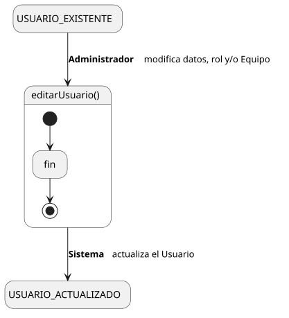
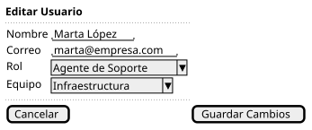

[HelpDesk](../../../README.md) / [Fase de Elaboración](../../README.md) / [Especificación de Casos de Uso](../README.md) / [Usuario](README.md)

# UC-39 · Editar Usuario

| Campo | Valor |
|---|---|
| Actor principal | Administrador del Sistema |
| Precondición | El `Usuario` existe |
| Postcondición (éxito) | Se actualizan nombre, correo, rol y/o `Equipo` del `Usuario` |
| Postcondición (fallo) | El `Usuario` conserva sus valores anteriores; el Sistema muestra los errores de validación |

<table>
<tr><td align="center">

</td></tr>
<tr><td align="center"><i><a href="../../../../puml/02-fase-elaboracion/especificacion-casos-uso/usuario/UC39-editar-usuario.puml">Código fuente</a></i></td></tr>
</table>

### Wireframe

<table>
<tr><td align="center">

</td></tr>
<tr><td align="center"><i><a href="../../../../puml/02-fase-elaboracion/especificacion-casos-uso/usuario/UC39-editar-usuario-wireframe.puml">Código fuente</a></i></td></tr>
</table>

### Flujo básico

1. El Administrador abre un Usuario existente ([UC-37](UC-37-ver-usuario.md)).
2. El Administrador selecciona "Editar Usuario".
3. El Sistema muestra el formulario precargado con los valores actuales.
4. El Administrador modifica nombre, correo, rol y/o `Equipo`, y confirma.
5. El Sistema valida que el nombre y el correo no queden vacíos, y que el correo no quede duplicado.
6. El Sistema actualiza el `Usuario`.
7. El Sistema muestra la confirmación.

### Flujos alternativos

- **FA-1 — Validación fallida o correo duplicado (paso 5):** el Sistema muestra el error junto al campo y vuelve al paso 4, conservando lo ya editado.

### Reglas de negocio relacionadas

- **Aquí es donde se reasigna el `Equipo` de un Agente de Soporte** — decisión ya fijada en el [Modelo de Casos de Uso](../../../01-fase-inicio/casos-de-uso.md): "la pertenencia de un agente a un Equipo se edita desde Editar Usuario, no desde un caso de uso propio de Equipo". Cierra la nota que dejó pendiente **R-04** en la [Lista de Riesgos](../../../01-fase-inicio/lista-riesgos.md) sobre "gestión de miembros de Equipo".
- **Cambiar el rol de un Usuario tiene la misma tensión de diseño que [UC-36](UC-36-crear-usuario.md).** El rol es una jerarquía de clases en el Modelo de Dominio, no un atributo — cómo se traduce un cambio de rol (p. ej. de Solicitante a Agente de Soporte) a nivel de implementación queda pendiente para el Modelo de Análisis/Diseño.
