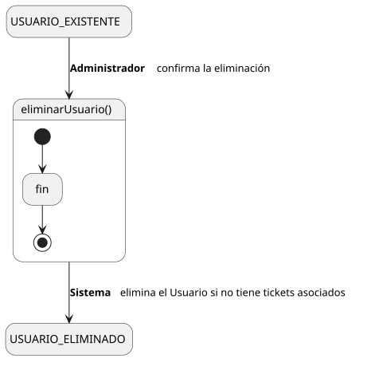
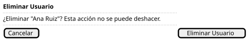

[HelpDesk](../../../README.md) / [Fase de Elaboración](../../README.md) / [Especificación de Casos de Uso](../README.md) / [Usuario](README.md)

# UC-40 · Eliminar Usuario

| Campo | Valor |
|---|---|
| Actor principal | Administrador del Sistema |
| Precondición | El `Usuario` existe, no es Solicitante de ningún `Ticket` y no tiene `Ticket` activos asignados como Agente |
| Postcondición (éxito) | El `Usuario` se elimina |
| Postcondición (fallo) | El `Usuario` sigue existiendo; el Sistema informa por qué no se pudo eliminar |

<table>
<tr><td align="center">

</td></tr>
<tr><td align="center"><i><a href="../../../../puml/02-fase-elaboracion/especificacion-casos-uso/usuario/UC40-eliminar-usuario.puml">Código fuente</a></i></td></tr>
</table>

### Wireframe

<table>
<tr><td align="center">

</td></tr>
<tr><td align="center"><i><a href="../../../../puml/02-fase-elaboracion/especificacion-casos-uso/usuario/UC40-eliminar-usuario-wireframe.puml">Código fuente</a></i></td></tr>
</table>

### Flujo básico

1. El Administrador abre un Usuario existente ([UC-37](UC-37-ver-usuario.md)).
2. El Administrador selecciona "Eliminar Usuario".
3. El Sistema verifica que el Usuario no sea Solicitante de ningún `Ticket` ni tenga `Ticket` activos asignados como Agente.
4. El Sistema pide confirmación.
5. El Administrador confirma.
6. El Sistema elimina el `Usuario`.
7. El Sistema muestra la confirmación.

### Flujos alternativos

- **FA-1 — El Usuario tiene Tickets asociados (paso 3):** el Sistema rechaza la eliminación e informa el motivo (Solicitante de tickets existentes, o Agente con tickets activos); no llega a pedir confirmación.

### Reglas de negocio relacionadas

- **Decisión de diseño nueva: no se puede eliminar un Usuario que sea Solicitante de algún Ticket, ni un Agente con tickets activos asignados.** La relación `Usuario — Ticket` ("reporta") es obligatoria en el [Modelo de Dominio](../../../01-fase-inicio/modelo-dominio/diagrama-clases.md) — todo ticket necesita un Solicitante — así que eliminarlo rompería esa trazabilidad. Un Agente con tickets activos tampoco puede eliminarse sin antes reasignarlos ([UC-18](../tickets/UC-18-asignar-ticket.md)/[UC-19](../tickets/UC-19-reasignar-ticket.md)), para no dejar trabajo en curso huérfano. Mismo espíritu que la validación de [Eliminar Prioridad (UC-35)](../prioridad/UC-35-eliminar-prioridad.md), aplicado aquí a dos relaciones obligatorias en vez de una.
- **No se introduce un estado "activo/inactivo" como alternativa a eliminar.** No está modelado en el Modelo de Dominio y ningún caso de uso lo pide todavía — se puede reconsiderar en Construcción si hace falta dar de baja a un Usuario sin poder eliminarlo (por tener tickets históricos).
