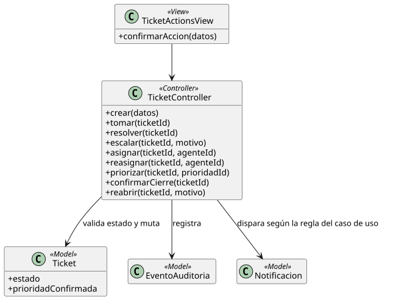

[HelpDesk](../../README.md) / [Fase de Elaboración](../README.md) / [Modelo de Análisis/Diseño](README.md)

# Patrón 02 · Ciclo de vida del Ticket

| Campo | Valor |
|---|---|
| Casos de uso que cubre | [UC-03](../especificacion-casos-uso/tickets/UC-03-crear-ticket.md), [UC-07](../especificacion-casos-uso/tickets/UC-07-confirmar-cierre-ticket.md), [UC-08](../especificacion-casos-uso/tickets/UC-08-reabrir-ticket.md), [UC-11](../especificacion-casos-uso/tickets/UC-11-tomar-ticket.md), [UC-12](../especificacion-casos-uso/tickets/UC-12-resolver-ticket.md), [UC-13](../especificacion-casos-uso/tickets/UC-13-escalar-ticket.md), [UC-18](../especificacion-casos-uso/tickets/UC-18-asignar-ticket.md), [UC-19](../especificacion-casos-uso/tickets/UC-19-reasignar-ticket.md), [UC-41](../especificacion-casos-uso/tickets/UC-41-priorizar-ticket.md) |
| Resumen | Toda acción que muta el `estado` (o la `Prioridad`/el `AgenteSoporte`) de un `Ticket` existente, siguiendo el [Diagrama de Estados](../../01-fase-inicio/modelo-dominio/diagrama-estados.md) |

<table>
<tr><td align="center">

</td></tr>
<tr><td align="center"><i><a href="../../../puml/02-fase-elaboracion/modelo-analisis-diseno/patron02-ciclo-vida-ticket.puml">Código fuente</a></i></td></tr>
</table>

## Vista — `TicketActionsView`

Es el mismo patrón para las 9: un botón o formulario corto sobre el detalle del ticket ("Tomar Ticket", "Escalar Ticket", "Confirmar Cierre"...), a veces con un campo adicional (motivo del escalamiento en UC-13, agente elegido en UC-18/UC-19, prioridad elegida en UC-41). No se modela como 9 vistas distintas porque ninguna tiene una interacción propia más allá de "confirmar la acción con los datos mínimos que pide".

## Controlador — `TicketController`

Un método por transición — `crear()`, `tomar()`, `resolver()`, `escalar()`, `asignar()`, `reasignar()`, `priorizar()`, `confirmarCierre()`, `reabrir()` — pero todos con la misma forma interna, ya fijada al detallar cada caso de uso: cargar el `Ticket`, verificar que su `estado` cumple la precondición, mutar el dato correspondiente, registrar un `EventoAuditoria` del tipo que ya definió su especificación (Creación/Asignación/Reasignación/Resolución/Escalamiento/Cierre/Reapertura/Priorización), y disparar la `Notificacion` que le corresponda según la [regla ya fijada en el Modelo de Dominio](../../01-fase-inicio/modelo-dominio/README.md#reglas-de-negocio-capturadas-para-casos-de-uso).

## Modelo — `Ticket`, `EventoAuditoria`, `Notificacion`

Ninguna de las tres necesita atributos técnicos nuevos frente al Modelo de Dominio — este patrón confirma que la estructura ya definida en Inicio aguanta las 9 transiciones sin cambios, que es exactamente lo que la Fase de Elaboración necesita validar antes de cerrar el hito LCAM.
