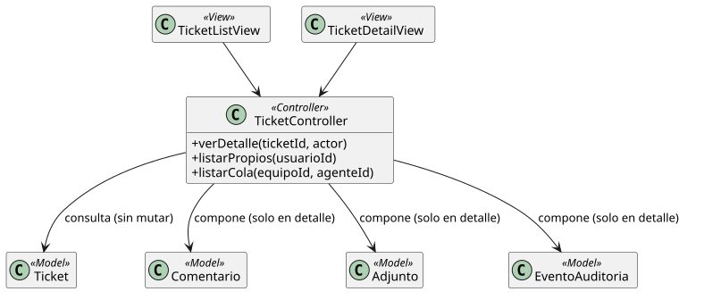

[HelpDesk](../../README.md) / [Fase de Elaboración](../README.md) / [Modelo de Análisis/Diseño](README.md)

# Patrón 03 · Consulta de Tickets

| Campo | Valor |
|---|---|
| Casos de uso que cubre | [UC-04 Ver Ticket](../especificacion-casos-uso/tickets/UC-04-ver-ticket.md), [UC-05 Listar Tickets Propios](../especificacion-casos-uso/tickets/UC-05-listar-tickets-propios.md), [UC-14 Listar Cola de Tickets](../especificacion-casos-uso/tickets/UC-14-listar-cola-de-tickets.md) |
| Resumen | Lecturas de solo consulta — ninguna muta el `Ticket` ni sus datos compuestos |

<table>
<tr><td align="center">

</td></tr>
<tr><td align="center"><i><a href="../../../puml/02-fase-elaboracion/modelo-analisis-diseno/patron03-consulta-tickets.puml">Código fuente</a></i></td></tr>
</table>

## Vistas — `TicketDetailView`, `TicketListView`

`TicketDetailView` resuelve UC-04: es la primera vista que compone `Comentario`, `Adjunto` y `EventoAuditoria` de un mismo `Ticket` a la vez. `TicketListView` resuelve UC-05 y UC-14 con el mismo componente, cambiando solo el filtro que le pasa al Controlador — la propia especificación de UC-05 señala que reutiliza el patrón de filtrado de UC-14.

## Controlador — `TicketController`

Reutiliza la misma clase del [Patrón 02](patron-02-ciclo-vida-ticket.md) (un caso de uso real no necesita un Controller de solo-lectura aparte de uno de escritura sobre la misma entidad):

- `verDetalle(ticketId, actor)`: valida acceso (UC-04) y devuelve el ticket con sus composiciones.
- `listarPropios(usuarioId)`: tickets donde `Usuario` = actor (UC-05).
- `listarCola(equipoId, agenteId)`: tickets sin `AgenteSoporte` de Categorías del Equipo + tickets asignados al agente (UC-14).

## Modelo — `Ticket`, `Comentario`, `Adjunto`, `EventoAuditoria`

Sin cambios técnicos nuevos frente al [Patrón 02](patron-02-ciclo-vida-ticket.md) — este patrón solo confirma que las tres composiciones de `Ticket` se pueden leer juntas sin necesitar una vista materializada ni desnormalización adicional.
