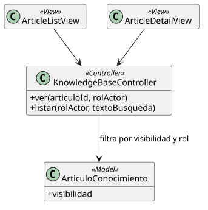

[HelpDesk](../../README.md) / [Fase de Elaboración](../README.md) / [Modelo de Análisis/Diseño](README.md)

# Patrón 05 · Base de Conocimiento (lectura)

| Campo | Valor |
|---|---|
| Casos de uso que cubre | [UC-09 Ver Artículo de Conocimiento](../especificacion-casos-uso/base-conocimiento/UC-09-ver-articulo-conocimiento.md), [UC-10 Listar Artículos de Conocimiento](../especificacion-casos-uso/base-conocimiento/UC-10-listar-articulos-conocimiento.md) |
| Resumen | Lecturas de `ArticuloConocimiento` filtradas por `visibilidad` según el rol del actor |

<table>
<tr><td align="center">

</td></tr>
<tr><td align="center"><i><a href="../../../puml/02-fase-elaboracion/modelo-analisis-diseno/patron05-base-conocimiento-lectura.puml">Código fuente</a></i></td></tr>
</table>

## Vistas — `ArticleListView`, `ArticleDetailView`

Mismo componente independientemente del rol del actor — la diferencia de alcance (Público vs. Público+Interno) es un filtro que aplica el Controlador, no una vista distinta por rol (decisión ya fijada en el [Modelo de Casos de Uso](../../01-fase-inicio/casos-de-uso.md)).

## Controlador — `KnowledgeBaseController`

- `ver(articuloId, rolActor)`: deniega si `visibilidad` = Interno y el actor es Solicitante puro.
- `listar(rolActor, textoBusqueda)`: filtra por `visibilidad` accesible al rol, y por un `textoBusqueda` simple sobre título/contenido — explícitamente no un motor de búsqueda de texto completo (ver [UC-10](../especificacion-casos-uso/base-conocimiento/UC-10-listar-articulos-conocimiento.md#reglas-de-negocio-relacionadas)).

## Modelo — `ArticuloConocimiento`

Sin atributos técnicos nuevos frente al Modelo de Dominio en este patrón — los que se agregan (`autor`) llegan con la escritura, ver [Patrón 06](patron-06-crud-generico.md).
