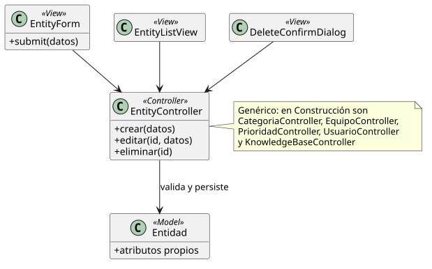

[HelpDesk](../../README.md) / [Fase de Elaboración](../README.md) / [Modelo de Análisis/Diseño](README.md)

# Patrón 06 · CRUD de configuración y contenido

| Campo | Valor |
|---|---|
| Casos de uso que cubre | [UC-15 a 17](../especificacion-casos-uso/base-conocimiento/README.md) (Artículo), [UC-21 a 25](../especificacion-casos-uso/categoria/README.md) (Categoría), [UC-26 a 30](../especificacion-casos-uso/equipo/README.md) (Equipo), [UC-31 a 35](../especificacion-casos-uso/prioridad/README.md) (Prioridad), [UC-36 a 40](../especificacion-casos-uso/usuario/README.md) (Usuario) |
| Resumen | Crear/Ver/Listar/Editar/Eliminar sobre 5 entidades distintas, todas resueltas con la misma forma desde que [UC-21](../especificacion-casos-uso/categoria/UC-21-crear-categoria.md) fijó la plantilla |

<table>
<tr><td align="center">

</td></tr>
<tr><td align="center"><i><a href="../../../puml/02-fase-elaboracion/modelo-analisis-diseno/patron06-crud-generico.puml">Código fuente</a></i></td></tr>
</table>

El diagrama usa nombres genéricos (`EntityForm`, `EntityController`, `Entidad`) porque las 5 entidades comparten exactamente la misma forma — no porque exista un único Controller genérico en la implementación real. En Construcción esto se traduce en cinco Controllers concretos: `CategoriaController`, `EquipoController`, `PrioridadController`, `UsuarioController`, y el `KnowledgeBaseController` del [Patrón 05](patron-05-base-conocimiento-lectura.md), que gana los métodos de escritura para `ArticuloConocimiento`.

## Vistas — `EntityForm`, `EntityListView`, `DeleteConfirmDialog`

`EntityForm` sirve tanto para Crear como para Editar (mismos campos, precargados en el segundo caso). `DeleteConfirmDialog` es el mismo diálogo de confirmación en las 5 entidades — solo cambia el mensaje cuando el borrado queda bloqueado (ver Controlador).

## Controlador — `EntityController` (uno por entidad)

- `crear(datos)` / `editar(id, datos)`: valida y persiste. Ninguna de las 5 entidades genera `EventoAuditoria` (decisión fijada en [UC-21](../especificacion-casos-uso/categoria/UC-21-crear-categoria.md) y extendida a las demás).
- `eliminar(id)`: la validación **no** es igual en las 5 — es la única asimetría real de este patrón:
  - **Sin bloqueo** ([Equipo](../especificacion-casos-uso/equipo/UC-30-eliminar-equipo.md)): `Categoria — Equipo` y `AgenteSoporte — Equipo` son opcionales, así que perder el Equipo es un estado válido.
  - **Bloqueado si está en uso** ([Categoría](../especificacion-casos-uso/categoria/UC-25-eliminar-categoria.md), [Prioridad](../especificacion-casos-uso/prioridad/UC-35-eliminar-prioridad.md), [Usuario](../especificacion-casos-uso/usuario/UC-40-eliminar-usuario.md)): `Ticket — Categoria`, `Ticket — Prioridad` y `Usuario — Ticket` (reporta) son obligatorias, así que eliminar rompería esa relación.
  - `ArticuloConocimiento` no bloquea el borrado, pero **elimina en cascada** su asociación con los `Ticket` que lo tenían vinculado (ver [UC-17](../especificacion-casos-uso/base-conocimiento/UC-17-eliminar-articulo-conocimiento.md)).

## Modelo — `Entidad` (`Categoria`, `Equipo`, `Prioridad` + `SLA`, `Usuario`, `ArticuloConocimiento`)

`ArticuloConocimiento` gana la relación `autor` hacia `Usuario` (gap detectado al detallar [UC-15](../especificacion-casos-uso/base-conocimiento/UC-15-crear-articulo-conocimiento.md), ya incorporado al [Diagrama de Clases](../../01-fase-inicio/modelo-dominio/diagrama-clases.md)). `Usuario` deja pendiente para Construcción cómo su jerarquía de clases (`Usuario ← AgenteSoporte ← Supervisor`, `Usuario ← Administrador`) se traduce a una única operación `crear()`/`editar()` — mismo punto abierto que el [Patrón 01](patron-01-acceso-sesion.md).
