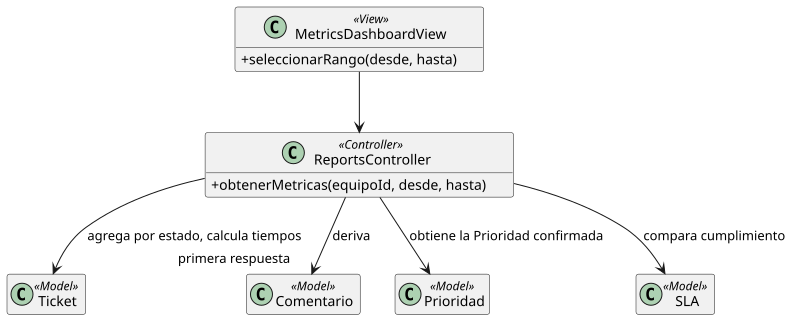

[HelpDesk](../../README.md) / [Fase de Elaboración](../README.md) / [Modelo de Análisis/Diseño](README.md)

# Patrón 07 · Dashboard de Métricas

| Campo | Valor |
|---|---|
| Casos de uso que cubre | [UC-20 Ver Dashboard de Métricas](../especificacion-casos-uso/reportes/UC-20-ver-dashboard-metricas.md) |
| Resumen | Único patrón de agregación/cálculo del catálogo — no opera sobre una sola entidad, sino sobre un conjunto de `Ticket` |

<table>
<tr><td align="center">

</td></tr>
<tr><td align="center"><i><a href="../../../puml/02-fase-elaboracion/modelo-analisis-diseno/patron07-dashboard-metricas.puml">Código fuente</a></i></td></tr>
</table>

## Vista — `MetricsDashboardView`

Selector de rango de fechas + los tres bloques de KPIs (volumen, tiempos promedio, cumplimiento de SLA) definidos en [UC-20](../especificacion-casos-uso/reportes/UC-20-ver-dashboard-metricas.md).

## Controlador — `ReportsController`

`obtenerMetricas(equipoId, desde, hasta)` hace todo el trabajo en una sola consulta agregada — no hay mutación ni un segundo método:

- Filtra `Ticket` por Categorías del `Equipo` del actor y por `fechaCreacion` dentro del rango.
- Calcula tiempo de primera respuesta derivándolo del primer `Comentario` de un Agente de Soporte — no existe un campo propio para esto, es el único patrón que deriva un dato en vez de leerlo directo de una columna.
- Compara `fechaResolucion - fechaCreacion` contra `SLA.tiempoResolucion` de la `Prioridad` confirmada de cada ticket, en vivo, sin almacenar el resultado — resuelve **R-07** (ver [Lista de Riesgos](../../01-fase-inicio/lista-riesgos.md)).

## Modelo — `Ticket`, `Comentario`, `Prioridad`, `SLA`

Ninguno gana estructura nueva — este patrón es puramente de lectura y cálculo sobre datos que ya existen, la misma confirmación que cierra R-07: la complejidad de `SLA` no exigía cambios de estructura, solo lógica de cálculo en el Controlador.
